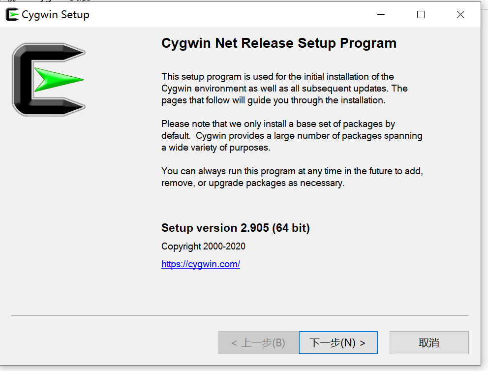
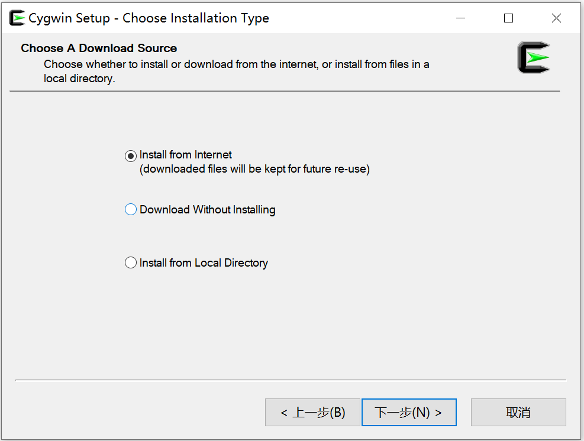
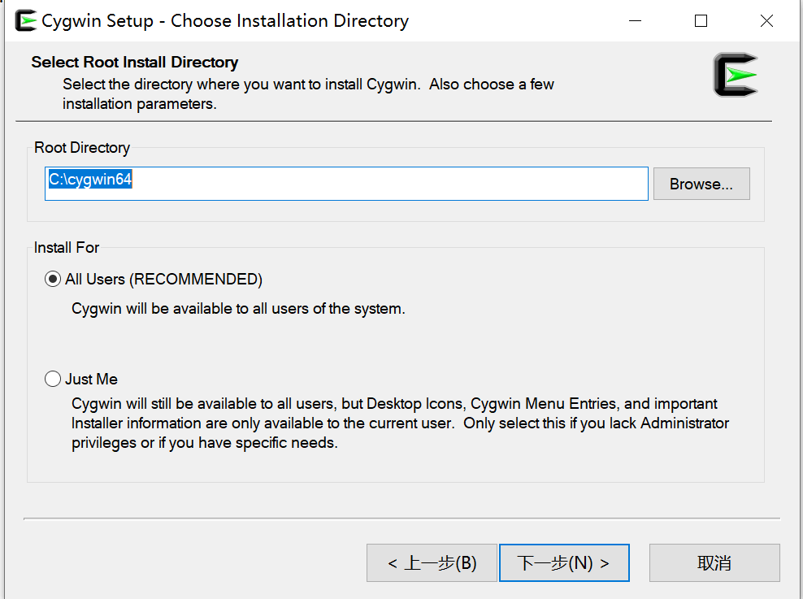
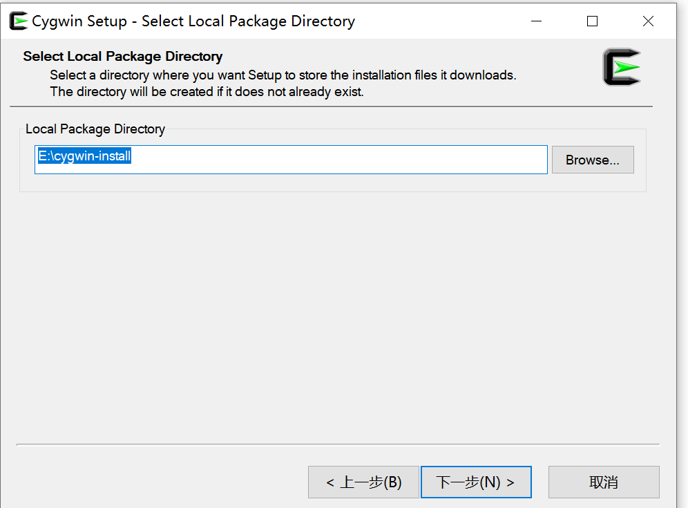
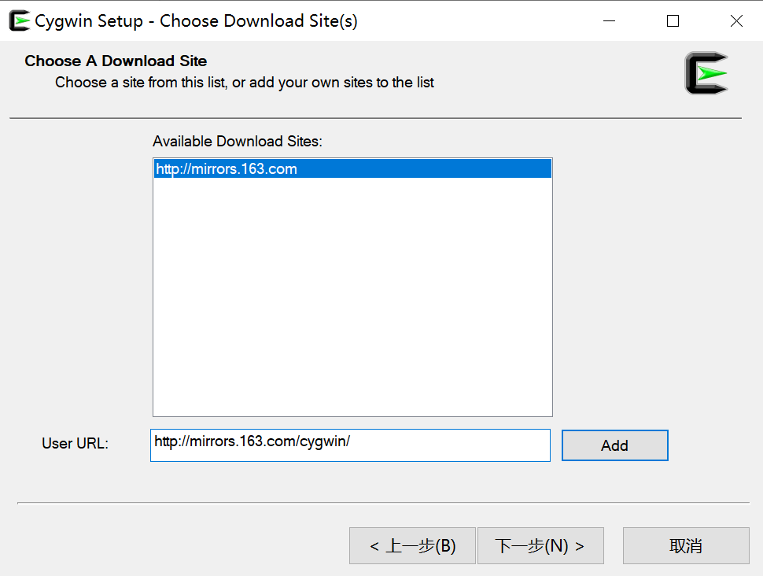
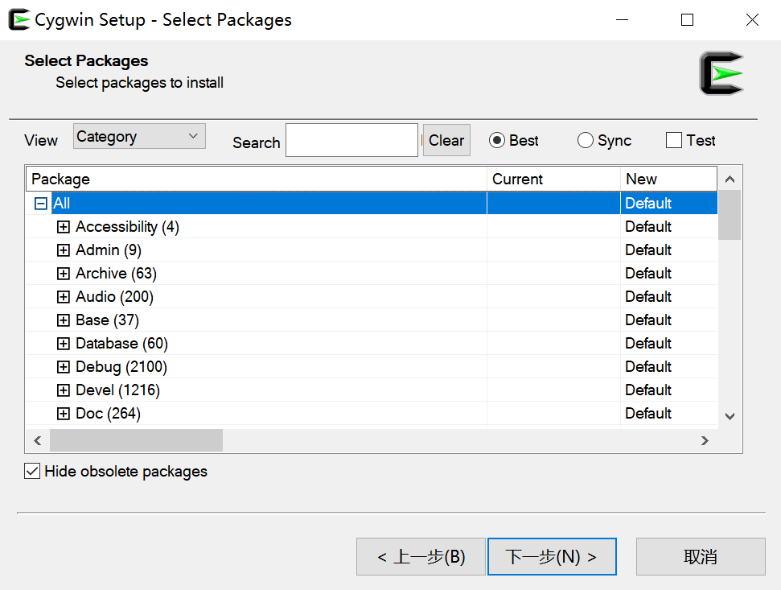

## window安装Cygwin

> Cygwin是一个用于Windows的类unix shell环境，可用于在windows上运行unix命令
>
> 安装参考资料
>
> https://wenku.baidu.com/view/44924d2be2bd960590c67781.html
>
> https://blog.csdn.net/superbinbin1/article/details/10147421
>
> 卸载参考资料
>
> https://www.shuijingwanwq.com/2020/08/12/4397/

### 下载最新版本的安装包：

- http://www.cygwin.com/setup-x86_64.exe 

### 运行setup-x86_64.exe进入安装

- **1** 开始安装

  

- **2** 选择Cygwin的安装方式 “Choose installation type”界面：

  

  其中有三个选项：**选第一个**

  - [x] Install from internet(downloaded files will be kept for feature reuse)
    从网上下载（下载下来的文件，也可以将来再用）

    其意思是，从网上下载的文件，存在本地硬盘后，以后万一遇到诸如某个模块被破坏了，不能用了，则可以再通过此setup.exe去重新安装一下，但是选择的是下面要说的第三项，即选择从本地某个文件夹安装，即此处之前下载好了的，效果相当于，windows中安装程序的修复功能。

  - [ ] Download Without Installing
    只下载不安装

    其用意，暂时没有完全搞懂。大概是为了先完全下载下来，然后方便选择性的安装自己需要的模块吧。

  - [ ] Install from Local Directory
    为选择从本地安装

    上面已经提到了，其前提是，之前已经下载过了对应的所需的各个安装模块了，此时可以选择此项，去全新安装或者修复式安装某个模块。

- **3** 选择安装文件夹

  

- **4** 选择Cygwin的本地安装包下载路径

  

- **5** 选择网络连接方式

  此时对于网络连接方式，有几种选择：**选第一个**

  - [x] Direct Connection
    一般多数用户都是这种直接连接的网络，所以都是直接使用默认设置即可。

  - [ ] Use Internet Explorer Proxy Settings
    使用IE代理设置，如果你本身上网是通过代理上的，且IE中已经设置好了代理，那么就可以用此种设置了。

  - [ ] Use HTTP/FTP Proxy
    使用HTTP或FTP类型的代理。同理，如果有需要，自己选择此项后，设置对应的代理地址和端口，即可。

- **6** 选择（所要连接的）服务器（去用于后续下载文件）

  > 第5步后，稍等片刻会加载出  **可用下载站点**  列表选项

  如果没有加载出可用选项

  在Use URL处，输入：

  http://mirrors.163.com/cygwin/

  

  点下一步

- **7** 选择需要安装的模块（安装包）, 直接全部下载，点击All

  - 

    后面都是按提示 点下一步 就完了

