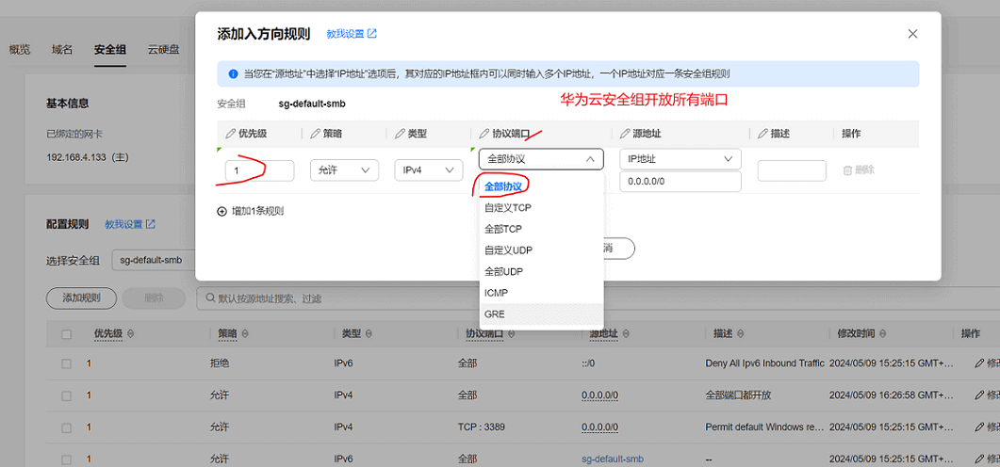

# 发布一个前后端项目到云服务器
首先你得先有一台云服务器，目前有阿里云、腾讯云、华为云等云服务器提供商，这里以`华为云 CentOS 7.6 64bit`为例。
## 云服务器安全组，开放进入端口
进入安全组，添加规则，这里直接开放了所有端口




## 压缩包都存放在 `note/books项目发布云服务器/source` 目录下
navicat破解.zip、Xshell6和Xftp6破解免安装版.zip、redis-7.0.5.tar.gz

## 安装 mysql
[请点击查看](./安装mysql.md)

## 安装 nodeJs
[用nvm安装请点击查看](../linux/安装nvm管理node版本+安装nrm管理npm源.md)

[用xx.tar压缩包安装请点击查看](./安装nodejs.md)

## 安装 Redis
[请点击查看](./安装Redis.md)

[redis-7.0.5.tar.gz压缩包](./source/redis-7.0.5.tar.gz)

## 通过Xftpr把后端项目上传到云服务器
先删除 node_modules 文件夹，然后配置好mysql、redis等服务器线上地址及端口等

然后通过Xftp把后端项目上传到云服务器

再cd 到项目文件夹中 安装依赖
```
npm install

```

然后运行项目
```
npm run prod
```

## 使用 pm2 进程管理工具管理项目
[请点击查看](./使用pm2管理项目.md)


## 使用nginx做静态资源服务器和反向代理服务器

[请点击查看](./使用nginx做静态资源服务器和反向代理服务器.md)
