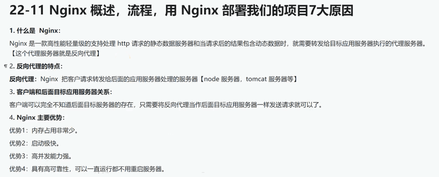
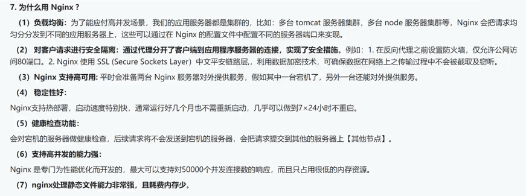

## 使用nginx做前端静态资源服务器和接口反向代理服务器






### 安装nginx

第一步
 ```bash
# 选安装 epel
yum install -y epel-release

 ```
第二步 查看 epel 帮助下载好的 nginx 安装程序, 借助 `| grep nginx` 命令过滤查看
```bash
yum list all | grep nginx
```

第三步 用yum安装nginx
```bash
yum install nginx -y

#查看nginx安装目录
rpm -ql nginx

#还有一个查看安装地址命令
whereis nginx

# 过滤只查看 etc目录
rpm -ql nginx | grep etc

# 过滤只查看 sbin目录（sbin目录保存的程序启动文件）
rpm -ql nginx | grep sbin
```


```bash
/var/log/nginx/access.log # 访问日志

/var/log/nginx/error.log # 错误日志

/etc/nginx/nginx.conf # nginx枋心配置文件

/usr/sbin/nginx # nginx启动命令，可直接在命令行中执行，当于配好了环境境变量

nginx # 启功nginx

nginx -s reload # 重启nginx

nginx -s stop # 停止nginx

nginx -s quit # 安全退出nginx

nginx -s reopen # 重新打开日志文件

nginx -t # 测试配置文件是否正确


netstat -tunlp | grep nginx; # 查看nginx进程运行状态

killall -9 nginx; # 杀死nginx进程

```

### 此时nginx 已经安装好了，先把前端项目做好生产配置，再打包上传服务器
[前端项目github地址：frontend_vue3.4文件夹](https://github.com/zoujian3820/vite_books_full_stack)

- `用的Vite打包工具加Vue3、Ts，打包生产前，可在本地使用 preview 命令预览打包后的项目`

  但需要改一点配置
  ```ts
  # .env.production 生产环境变量配置文件

  VITE_ROUTER_BASE_URL=/
  VITE_HOST='0.0.0.0' # 此时都只能先用本地地址, 才能在本地跑起来
  VITE_PORT=5002
  VITE_BASE_URL='/dang'
  VITE_PROXY_DOMAIN='http://192.168.0.198:8002/' # 线上接口地址，本地做接口转发


  # vite.config.ts 配置文件，增加preview配置
  return {
    base: envMap.VITE_ROUTER_BASE_URL || '/',
    build: {
      // 关闭资源转base64
      assetsInlineLimit: 0
    },
    // 使用preview在本地预览, 要添加如下配置，或者直接在这里写死不用上面的.env.production，或单独配置preview
    preview: {
      host: '0.0.0.0',
      port: Number(envMap.VITE_PORT),
      proxy: {
        [envMap.VITE_BASE_URL]: {
          target: envMap.VITE_PROXY_DOMAIN
        }
      }
    }
  }
  ```
  执行npm run build && npm run preview
  
  打包完后，就直接自动跑起来了，此时会自动打开浏览器并打开页面


- `没啥问题的情况下，就直接打生产包啦，同样要更改配置啦`

  ```ts
  # .env.production 生产环境变量配置文件

  VITE_ROUTER_BASE_URL=/
  VITE_HOST='192.168.0.198' # 云服务器地址
  VITE_PORT=80 # nginx访问时端口

  # 接口地址的基础路径，给nginx接口转发做标识
  # 如 http://192.168.0.198/dang/ctgymodule/findFirstCtgys nginx遇到这个请求
  # 就会转发到 http://xxxx:xx/dang/ctgymodule/findFirstCtgys
  VITE_BASE_URL='/dang'

  // VITE_PROXY_DOMAIN这个就不需要删除了，因为nginx会做转发


  # vite.config.ts 配置文件，要删除 preview, 新增server配置
  return {
    server: {
      // 发生产只需要这两项，接口用 nginx 转发
      host: envMap.VITE_HOST,
      port: Number(envMap.VITE_PORT)
    }
  }
  ```
  配完了直接 `npm run build` 完事，把生成的 `dist` 文件夹内容 上传到服务器

  这里直接用 Xftp 上传，先在服务器 `/opt` 目录下新建一个存放前端打包文件的文件夹，这里我取名 booksFrontend

  ok 上传完后，按如下配置 nginx 

### 配置nginx

```bash
# 配置nginx
vim /etc/nginx/nginx.conf

# 配置nginx 默认访问目录
vim /etc/nginx/conf.d/default.conf

```

/etc/nginx/nginx.conf 配置文件的初始配置内容

```bash
# For more information on configuration, see:
#   * Official English Documentation: http://nginx.org/en/docs/
#   * Official Russian Documentation: http://nginx.org/ru/docs/

user nginx;
worker_processes auto;
error_log /var/log/nginx/error.log;
pid /run/nginx.pid;

# Load dynamic modules. See /usr/share/doc/nginx/README.dynamic.
include /usr/share/nginx/modules/*.conf;

events {
    worker_connections 1024;
}

http {
    log_format  main  '$remote_addr - $remote_user [$time_local] "$request" '
                      '$status $body_bytes_sent "$http_referer" '
                      '"$http_user_agent" "$http_x_forwarded_for"';

    access_log  /var/log/nginx/access.log  main;

    sendfile            on;
    tcp_nopush          on;
    tcp_nodelay         on;
    keepalive_timeout   65;
    types_hash_max_size 4096;

    include             /etc/nginx/mime.types;
    default_type        application/octet-stream;

    # Load modular configuration files from the /etc/nginx/conf.d directory.
    # See http://nginx.org/en/docs/ngx_core_module.html#include
    # for more information.
    include /etc/nginx/conf.d/*.conf;

    server {
        listen       80;
        listen       [::]:80;
        server_name  _;
        root         /usr/share/nginx/html;

        # Load configuration files for the default server block.
        include /etc/nginx/default.d/*.conf;

        error_page 404 /404.html;
        location = /404.html {
        }

        error_page 500 502 503 504 /50x.html;
        location = /50x.html {
        }
    }

# Settings for a TLS enabled server.
#
#    server {
#        listen       443 ssl http2;
#        listen       [::]:443 ssl http2;
#        server_name  _;
#        root         /usr/share/nginx/html;
#
#        ssl_certificate "/etc/pki/nginx/server.crt";
#        ssl_certificate_key "/etc/pki/nginx/private/server.key";
#        ssl_session_cache shared:SSL:1m;
#        ssl_session_timeout  10m;
#        ssl_ciphers HIGH:!aNULL:!MD5;
#        ssl_prefer_server_ciphers on;
#
#        # Load configuration files for the default server block.
#        include /etc/nginx/default.d/*.conf;
#
#        error_page 404 /404.html;
#            location = /40x.html {
#        }
#
#        error_page 500 502 503 504 /50x.html;
#            location = /50x.html {
#        }
#    }

}


```

配置时，主要配置 server 字段

```bash

server {
    listen       80;
    listen       [::]:80;
    # 默认值 _ 为匹配所有，正常填写你的网站访问域名，或填写你的网站访问IP地址（云主机的公网ip）
    server_name  129.79.159.56; 
    # 默认值/usr/share/nginx/html，可修改为你网站的存放目录
    # 意思是
    # 1. 先查找/usr/share/nginx/html目录下是否有index.html文件
    # 2. 如果有，则加载index.html文件
    # 3. 如果没有，则加载/usr/share/nginx/html目录下的default.html文件
    #root         /usr/share/nginx/html;
    
    # 访问books项目的index.html页面
    root    /opt/booksFrontend;

    location / { # location 字段，表示匹配 定位 的URL地址
      index  index.html; # index 字段，表示默认访问的文件名
    }
  
    location /dang {
      # pass # 表示将请求转发到其他服务器，这里转发到 http://13.06.77.87:8080端口
      # 那在浏览器访问 http://129.79.159.56/dang 就会转发到 http://129.79.159.56:8002/dang 
      # 且在nginx中转发是没有跨域问题的
      proxy_pass http://129.79.159.56:8002;
    }

    # 默认值/etc/nginx/default.d/*.conf，可修改为你网站的存放目录
    # 意思是
    # 1. 先查找/etc/nginx/default.d/目录下是否有.conf结尾的文件
    # 2. 如果有，则加载这些文件
    # 3. 如果没有，则加载/etc/nginx/default.d/目录下的default.conf文件
    include /etc/nginx/default.d/*.conf; 

    error_page 404 /404.html;
    location = /404.html {
    }

    error_page 500 502 503 504 /50x.html;
    location = /50x.html {
    }
}
```

nginx 配好后，直接按 `ESC` + `:wq` 保存退出

nginx 配置文件修改后，需要重启nginx， 这里执行如下命令

```bash
# 重启nginx
nginx -s reload
```

此时，你就可以在浏览器, 输入你的云主机公网ip(有域名就输域名) 访问你的网站了，项目就发布完了
