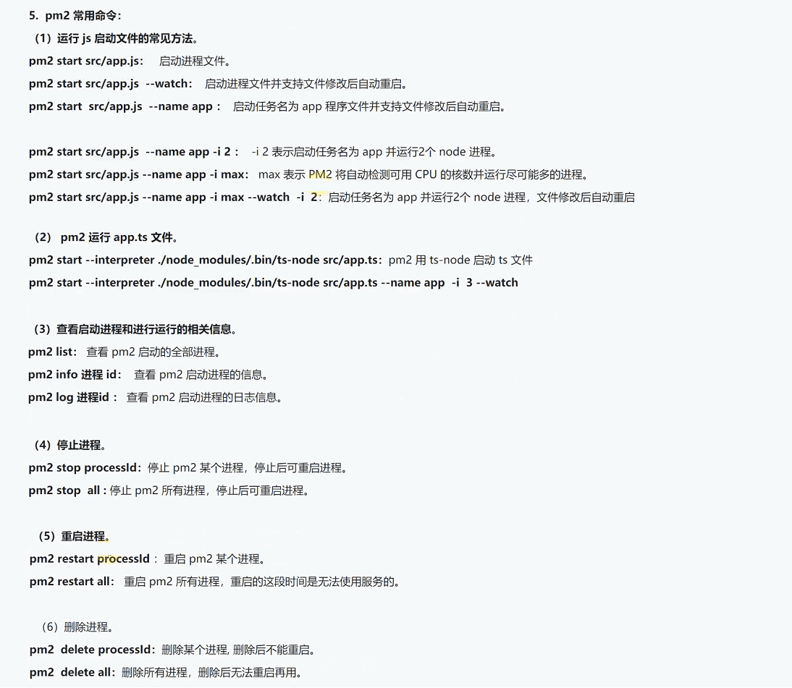

## 使用pm2管理项目





### 安装pm2

```bash
# 项目内局部安装
npm install pm2
# 全局安装
npm install pm2 -g
```


### 重启项目

```bash
pm2 restart 项目名 或 id
```

### 停止项目

```bash
pm2 stop 项目名 或 id
```

### 删除项目

```bash
pm2 delete 项目名 或 id
```

### 查看项目

```
pm2 list
```

### 查看日志

```bash
# 查看所有项目日志
pm2 logs

# 查看指定项目日志
pm2 logs 项目名 或 id
```

### 查看项目监控

```bash
pm2 monit
```


### 直接运行项目
package.json中加入如下脚本，运行books全栈后端项目

[项目github地址：server_koamysql文件夹](https://github.com/zoujian3820/vite_books_full_stack)

```json
  "scripts": {
    "dev": "set NODE_ENV=dev&& nodemon --watch src/ -e ts --exec ts-node ./src/app.ts",
    "prod": "set NODE_ENV=prod&& nodemon --watch src/ -e ts --exec ts-node ./src/app.ts",
    "pm2dev": "set NODE_ENV=dev&& npm run exec",
    "pm2prod": "set NODE_ENV=prod&& npm run exec",
    "pm2linuxdev": "export NODE_ENV=dev&& npm run exec",
    "pm2linuxprod": "export NODE_ENV=prod&& npm run exec",
    "exec": "pm2 start --interpreter ./node_modules/.bin/ts-node ./src/app.ts --name books -i 2 --watch"
  },
```
- 启动项目

  ```bash
  npm run pm2dev
  ```
  核心就是 `npm run exec` 执行的内容，设置环境变量 wnidow上用set linux上用 export

  也可用兼容工具 cross-env

  ```bash
  # 先下载安装 cross-env 到项目中
  npm install cross-env
  ```
  以下是使用 `cross-env` 的前后对比
  ```json
    "scripts": {
      "exec": "pm2 start --interpreter ./node_modules/.bin/ts-node ./src/app.ts --name books -i 2 --watch",
      
      # 看看 每次相同的命令要配两次，很麻烦对不对
      "dev_win": "set NODE_ENV=dev&& nodemon --watch src/ -e ts --exec ts-node ./src/app.ts",
      "dev_linux": "export NODE_ENV=dev&& nodemon --watch src/ -e ts --exec ts-node ./src/app.ts",
      "pm2dev_win": "set NODE_ENV=dev&& npm run exec",
      "pm2dev_linux": "export NODE_ENV=dev&& npm run exec",
     
      # 以下是 cross-env 简化版, 连后面的&& 都省略了，记住别加，加了变量值就加上后面的 && 成 dev&& 了
      "dev": "cross-env NODE_ENV=dev nodemon --watch src/ -e ts --exec ts-node ./src/app.ts",
      "pm2dev": "cross-env NODE_ENV=dev npm run exec",
    },
  ```  

### 使用配置文件

```ts
// 在项目根目录下创建一个 pm2.config.js
module.exports = {
  apps: [
    {
      name: 'books', // 项目名称
      script: 'src/app.ts', // 启动的入口文件
      ignore_watch: ['logs', 'mylog', 'dist', 'node_modules'], // 忽略监听的文件夹
      out_file: 'logs/out.log',
      error_file: 'logs/error.log',
      interpreter: './node_modules/.bin/ts-node', // 使用ts-node来启动项目
      instances: 3, // 启动的实例数量
      cwd: './', // 当前工作目录
      watch: true, // 监听文件变化，如果监听文件发生变化，那么就会重启
      max_memory_restart: '1G', // 子进程内存达到1G时，自动重启
      autorestart: true, // 子进程有错误退出后，主进程会让它自动重启
      exec_mode: 'cluster', // 定义参数，exec_mode为'cluster'，表示使用集群模式运行
      env: {
        // 'NODE_ENV': 'production',
        // 'PORT': 3000
        NODE_ENV: 'dev',
        PORT: 3002
        // 'DB_HOST': '127.0.0.1',
        // 'DB_PORT': 3306,
        // 'DB_USER': 'root',
        // 'DB_PASSWORD': '123456',
      }
    }
  ]
}

```

在package.json中添加执行脚本

```json
"scripts": {
  "pm2conf": "cross-env NODE_ENV=prod pm2 start pm2.config.js",
  "pm2restart": "pm2 restart books",
  "pm2stop": "pm2 stop books",
  "pm2log": "pm2 logs books",
  "pm2monit": "pm2 monit",
  "pm2reload": "pm2 reload books",
  "pm2delete": "pm2 delete books",
  "pm2list": "pm2 list",
  "pm2deleteall": "pm2 delete all"
}
```

### 启动项目

```bash
npm run pm2conf
```

### 当你用 nodemon 执行都没问题，但是用 pm2 启动就报错

此时不防重启一下电脑，再启动试试，如果还不行，那么就看看是不是配置文件写错了，或者是不是 node_modules 文件夹下没有 ts-node 文件

改用全局安装 npm install ts-node -g 试试, interpreter 后面可直接用 ts-node

```js
// pm2配置文件方式
{
  interpreter: 'ts-node',
}

// 直接运行的方式
pm2 start --interpreter ts-node ./src/app.ts --name books -i 2 --watch
```

作者就是，之前一直报错，本地window和线上centos都是一直报错，找不到ts-node

后面我的window笔记本电脑重启了，然后再跑就正常了，抱着怀疑的态度，centos上也重启了，然后就各种顺滑起来了，哈哈


centos上重启更简单哈，直接命令行小窗口输入 `reboot` 搞定，等个几十秒就重启完了 
