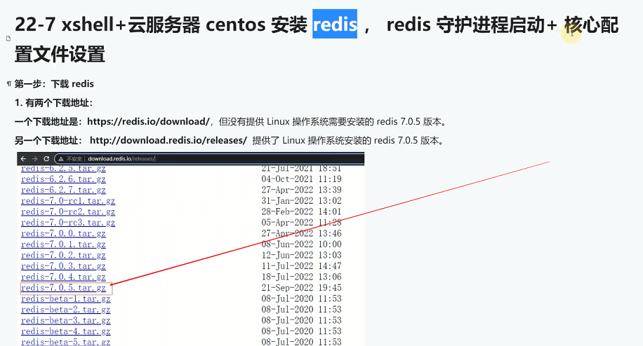
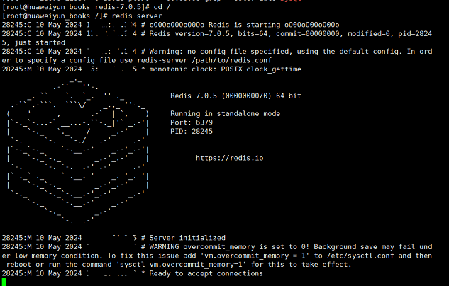
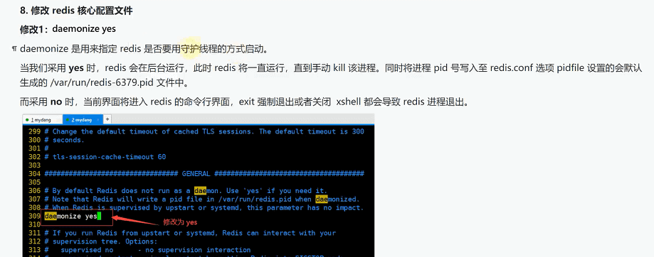
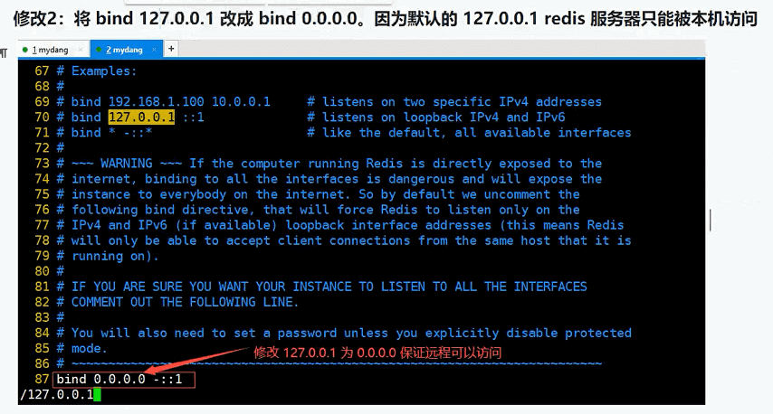

## 安装Redis

一个下载地址是：[https:/redis.io/download/](https:/redis.io/download/) 但没有提供Linux操作系统需要安装的redis7.0.5版本。

另一个下载地址：[http:/download.redis.io/releases/](http:/download.redis.io/releases/) 提供了Linuⅸ操作系统安装的redis7.0.5版本。



选择redis-7.0.5.tar.gz下载下来后，用Xftp把压缩包上传到服务器 /opt 目录下

```
mkdir redis

tar -xvf redis-7.0.5.tar.gz -C /opt/redis

cd /opt/redis/redis-7.0.5
````


解压完后，无法直接运行，要对redis源码进行编译，输入 `make` 命令开始编绎

```
make
```


编译完成后，redis-7.0.5/src目录下会生成一个 `redis-server` 文件，这个就是redis服务端启动程序，还有一个 `redis-cli` 客户端启动程序


给redis增加软链接


```
ln -s /opt/redis/redis-7.0.5/src/redis-server /usr/local/bin

ln -s /opt/redis/redis-7.0.5/src/redis-cli /usr/local/bin
```


启动redis服务端程序

```
redis-server
```

redis服务端程序启动后，会默认在6379端口监听客户端的连接请求，但这个窗口不能关闭，一旦关闭，redis-server 将停止运行



要想让 redis-server 后台运行的话，此时先不要跑起来，先配置一下redis服务端程序的配置文件 `redis.conf`


```
cd /opt/redis/redis-7.0.5

vim redis.conf

# 按i键进入编辑模式

# 内容太多，可以按ESC键，输入 :set nu 显示行号
# 按 :1 跳转到第1行
# 按 :$ 跳转到最后一行
# 按 :/redis 搜索redis
# 按N 跳转到下一个搜索结果
# 按n 跳转到上一个搜索结果
# 按ESC键，输入 :set ic 搜索不区分大小写
# 按ESC键，输入 :set hls 搜索高亮显示
# 按ESC键，输入 :set ai 自动缩进
# 按ESC键，输入 :set hlsearch 搜索高亮显示
# 按ESC键，输入 :set nohlsearch 搜索不高亮显示
# 按ESC键，输入 :set nu! 取消显示行号
# 按ESC键，输入 :set ai! 取消自动缩进
# 按ESC键，输入 :set hlsearch! 取消搜索高亮显示

# 编辑好了后，按ESC键，输入 :wq 保存并退出
# 不想保存，可以按 :q! 强制退出
```
查找 `daemonize` 配置 把 `no` 改为 `yes` 开启 redis-server 服务后台运行 

使用查找命令 `:/daemonize`




查找 `:/bind` 修改绑定ip地址为 0.0.0.0



查找 `:/protected-mode` 把 yes 改为 `no` 关闭保护模式，允许客户端访问


增加连接 redis服务器 需要认证的密码

在配置文件最末行加入 `requirepass 你要设置的密码` 这段代码

如: `requirepass 123456`


此时客户端请求 redis时，要带上 password 才能连接成功


修改配置文件后，需要重启redis服务端程序

```
# 先查看 redis 运行状态，有没有在运行

netstat -tunlp | grep redis-server
```


```
# 有运行，用命令先杀死进程
kill -9 进程号
# 或以下命令
killall -9 redis-server

```

```
# 重新启动redis服务端程序，并使用这个配置文件启动
redis-server /opt/redis/redis-7.0.5/redis.conf

# 此时是没有 redis-server 运行窗口了，已改为后台运行了
```


### 客户端连接 redis 服务器

```
redis-cli -h 127.0.0.1 -p 6379 -a 123456
```

### 配置开机自启动

```
# 首先在/etc目录下 创建一个 redis 目录
mkdir /etc/redis

# 把 redis.conf 文件复制到 /etc/redis 目录下
cp /opt/redis/redis-7.0.5/redis.conf /etc/redis/

# 创建一个 redis.service 文件
vim /etc/systemd/system/redis.service

<!-- netstat -tunlp | grep redis-server -->
<!-- killall -9 redis-server -->


# 写入以下内容
[Unit]
Description=Redis Server
After=network.target

[Service]
Type=forking
ExecStart=/usr/local/bin/redis-server /etc/redis/redis.conf

[Install]
WantedBy=multi-user.target
```

```
# 启动 redis 服务
systemctl start redis

# 设置开机自启动
systemctl enable redis

# 重启服务器
reboot

# 查看 redis 服务状态
systemctl status redis

# 停止 redis 服务
systemctl stop redis

# 重启 redis 服务
systemctl restart redis

# 重新加载 redis 配置文件
systemctl reload redis
```

### 更多redis使用方法，请查看
[redis使用方法](../数据库/redis.md)
