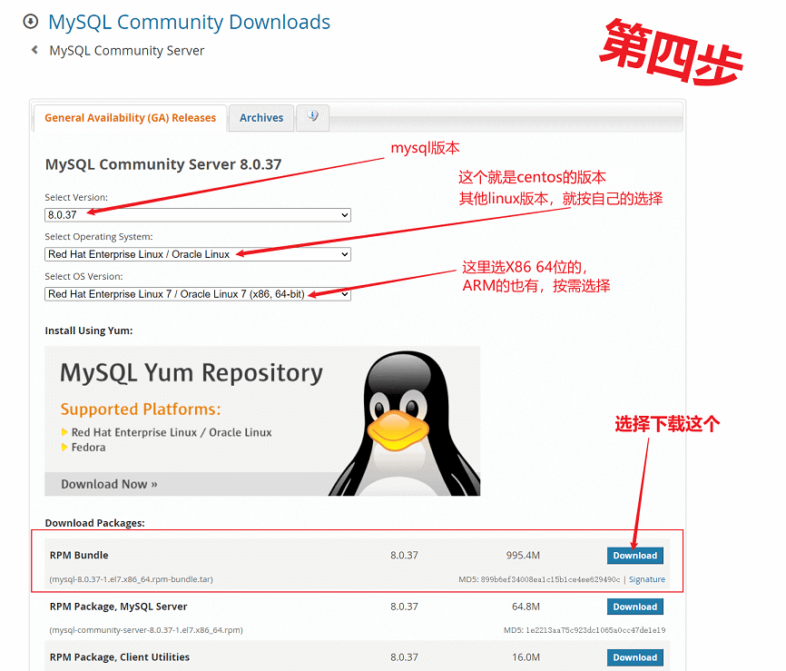
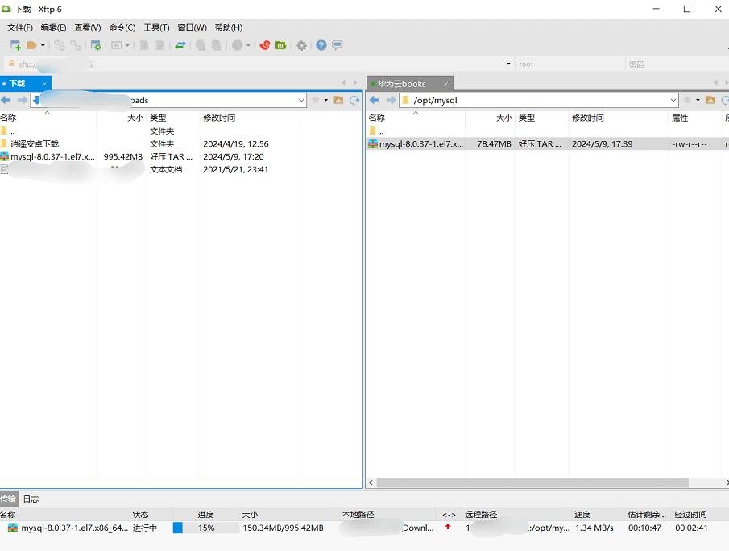
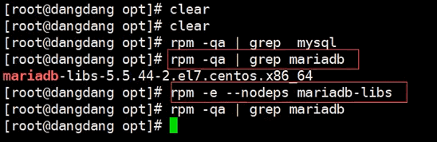
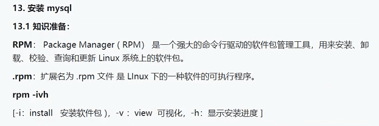
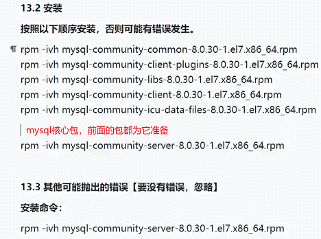
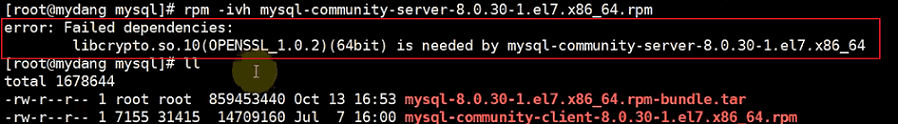
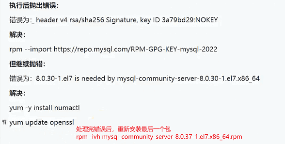
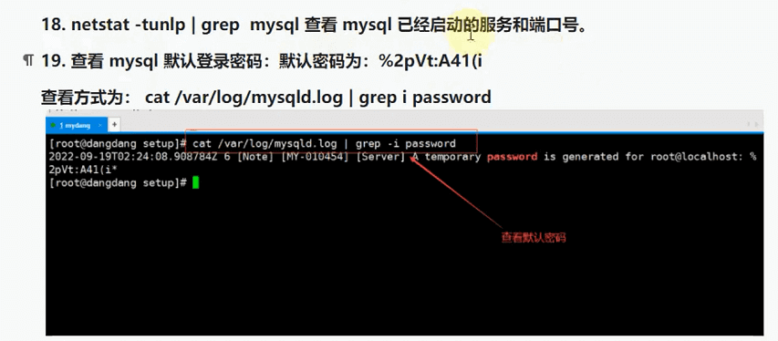

## 安装mysql
下载地址： https://www.mysql.com/cn/downloads/





第5步页面地址：https://dev.mysql.com/downloads/file/?id=527901

第5步下载地址：https://dev.mysql.com/get/Downloads/MySQL-8.0/mysql-8.0.37-1.el7.x86_64.rpm-bundle.tar


- 在服务器上用wget命令直接下载
  ```
  cd /opt
  mkdir mysql
  cd mysql
  wget https://dev.mysql.com/get/Downloads/MySQL-8.0/mysql-8.0.37-1.el7.x86_64.rpm-bundle.tar

  #如果下载错了，可以用以下命令处理
    # 移动当前目录下这个包，到mysql目录下
      mv mysql-8.0.37-1.el7.x86_64.rpm-bundle.tar mysql
    # 删除当前目录下这个包
      rm -rf mysql-8.0.37-1.el7.x86_64.rpm-bundle.tar
  ```
- 用Xftp上传 [Xfth安装包](./source/Xshell6和Xftp6破解免安装版.zip)

  先点击 [下载](https://dev.mysql.com/get/Downloads/MySQL-8.0/mysql-8.0.37-1.el7.x86_64.rpm-bundle.tar) 下来
再用Xftp上传到服务器文件夹 opt/mysql

  


  ```
  yum remove mysql # 删除自带的mysql

  rpm -qa | grep mariadb  # 搜索mariadb
  rpm -e --nodeps mariadb-libs # 删除mariadb
  或者写全名
  rpm -e --nodeps mariadb-libs-5.5.68-1.el7.x86_64

  # --nodeps 不验证软件包的依赖
  ```



- 解压下载下来的mysql压缩包 mysql-8.0.37-1.el7.x86_64.rpm-bundle.tar
  ```
  cd /opt/mysql
  # 用tar命令解压文件到 当前目录 ./ 下
  tar -xvf mysql-8.0.37-1.el7.x86_64.rpm-bundle.tar -C ./
  ```

- 安装mysql依赖包
  ```
  yum install libaio -y
  ```

- 安装mysql

  
  
  
  

  ```
  rpm -ivh mysql-community-common-8.0.37-1.el7.x86_64.rpm
  rpm -ivh mysql-community-client-plugins-8.0.37-1.el7.x86_64.rpm
  rpm -ivh mysql-community-libs-8.0.37-1.el7.x86_64.rpm
  rpm -ivh mysql-community-client-8.0.37-1.el7.x86_64.rpm
  rpm -ivh mysql-community-icu-data-files-8.0.37-1.el7.x86_64.rpm
  # mysql核心包
  rpm -ivh mysql-community-server-8.0.37-1.el7.x86_64.rpm
  ```


```
 rpm -ql mysql-community-server-8.0.37-1.el7.x86_64
 # 此时会打印出mysql的安装目录
```


```
# 查看mysql版本
mysql --version
mysql  Ver 8.0.37 for Linux on x86_64 (MySQL Community Server - GPL)

```


启动mysqld服务


启动mysqld
  ```
  # 启动mysqld
  systemctl start mysqld
  # 停止mysqld
  systemctl stop mysqld
  # 查看mysqld状态
  systemctl status mysqld
  ```


```
# 查看mysql端口
netstat -tunlp | grep mysql

# 查看当前mysql默认密码，密码为 qhNEb*srF1Uq
cat /var/log/mysqld.log | grep -i password

[root@huaweiyun_books mysql]# cat /var/log/mysqld.log | grep -i password
2024-05-09T11:05:17.480813Z 6 [Note] [MY-010454] [Server] A temporary password is generated for root@localhost: qhNEb*srF1Uq

```


登录并修改mysql的root密码
  ```
  # 进入mysql
  mysql -h localhost -u root -p # 密码为上面的默认密码 qhNEb*srF1Uq

  # 修改密码
  ALTER USER 'root'@'localhost' IDENTIFIED WITH mysql_native_password BY '1234';

  报错如下：
  ERROR 1819 (HY000): Your password does not satisfy the current policy requirements

  MySQL 有默认的密码策略：
  至少包含 1 位大写
  至少包含 1 位小写
  至少包含 1 位数字
  包含 1 个特殊符号
  必须 8 位及以上

  ALTER USER 'root'@'localhost' IDENTIFIED WITH mysql_native_password BY 'Mysql@1234';

  ```


```
# 查看当前的密码策略
show variables like 'validate_password%';

mysql> show variables like 'validate_password%';
+-------------------------------------------------+--------+
| Variable_name                                   | Value  |
+-------------------------------------------------+--------+
| validate_password.changed_characters_percentage | 0      |
| validate_password.check_user_name               | ON     |
| validate_password.dictionary_file               |        |
| validate_password.length                        | 8      |
| validate_password.mixed_case_count              | 1      |
| validate_password.number_count                  | 1      |
| validate_password.policy                        | MEDIUM |
| validate_password.special_char_count            | 1      |
+-------------------------------------------------+--------+
8 rows in set (0.01 sec)

# 修改密码策略

# 修改密码策略为低
set global validate_password.policy=LOW;
# 修改密码长度最低4位
set global validate_password.length=4;

# 修改密码
ALTER USER 'root'@'localhost' IDENTIFIED WITH mysql_native_password BY '1234';

# 到客户端登录root用户
mysql -h localhost -u root -p

输完密码后，报错如下：
Host 'xx.xx.xx.xx' is not allowed to connect to this MySQL server

到服务器上登录root用户然后，执行如下命令：
use mysql;
select host from user where user = 'root';
原因是root用户限制了只能在当前的ip内访问的，需要修改他的访问域。
update user set host='%' where user='root';

# 创建用户
CREATE USER 'admin' IDENTIFIED WITH mysql_native_password BY '1234';
# 给新用户赋权限
# 把所有增删改查的数据库权限，赋予给admin用户，@'%'指密码可以是任意的
grant all privileges ON *.* TO admin@'%';
```

创建数库库 `books`
```
create database books character set utf8mb4 collate utf8mb4_general_ci;

# 导入备份或导出的mysql数据, 先将books.sql文件上传到 /opt目录下
mysql -uadmin -p books < /opt/books.sql

# 导出mysql
mysqldump -u admin -p1234 books > /opt/books_db.sql
```

### 更多mysql使用方法，查看以下页面
mysql作为系统服务，会自动添加环境变量，和开机启动，所以可以直接使用mysql命令

[mysql更多使用方法，请点击查看](../数据库/mysql.md)
