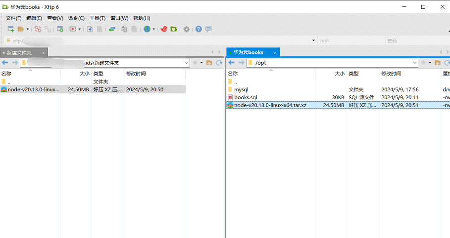

## 安装nodejs

安装包地址：https://nodejs.org/dist/v20.13.0/node-v20.13.0-linux-x64.tar.xz


下载好用Xftp上传到 /opt目录下



### 小知识：tar.gz文件和.tar.xz文件的区别【了解即可】

两种文件都是压缩了的tar文件，只是压缩算法不同。
- tar.gz使用的是gzip压缩工具，tar.xz使用的是xz工具。
- 但对于使用者来说，二者的解压没有区别。
- 注意：解压tar.xz是 tar-xvf 而不能使用 tar-zxvf

### 解压 node-v20.13.0-linux-x64.tar.xz

```
cd /opt
mkdir nodejs
cd nodejs

# 解压到当前 /opt/nodejs 目录下 得到解压文件夹 node-v20.13.0-linux-x64
tar -xvf node-v20.13.0-linux-x64.tar.xz -C ./

# 修改文件夹名称为 nodejs20.13
mv node-v20.13.0-linux-x64 nodejs20.13

# mv 命令可移动文件也可改名，移动地址不变就是改名

# 查找nodejs安装地址
find / -name nodejs

```
安装好后，在命令行无法使用node命令，需要配置环境变量或用软链接的方式

### 配置环境变量
env 命令查看当前所有环境变量
```
env

[root@huaweiyun_books nodejs]# env
XDG_SESSION_ID=1
HOSTNAME=huaweiyun_books
TERM=xterm
SHELL=/bin/bash
HISTSIZE=10000
SSH_CLIENT=121.32.50.158 38649 22
SSH_TTY=/dev/pts/0
USER=root
LS_COLORS=rs=0:di=01;34:ln=01;36:mh=00:pi=40;33:so=01;35:do=01;35:bd=40;
MAIL=/var/spool/mail/root
PATH=/usr/local/sbin:/usr/local/bin:/usr/sbin:/usr/bin:/root/bin
PWD=/opt/nodejs
LANG=en_US.UTF-8
HISTCONTROL=ignoredups
SHLVL=1
HOME=/root
LOGNAME=root
SSH_CONNECTION=121.32.50.158 38649 192.168.4.133 22
LESSOPEN=||/usr/bin/lesspipe.sh %s
XDG_RUNTIME_DIR=/run/user/0
HISTTIMEFORMAT=%F %T root 
_=/usr/bin/env
OLDPWD=/opt
[root@huaweiyun_books nodejs]# 

```

mysql不用配是因为mysql是rpm包安装的，系统服务会自动加载环境变量，

配置到了 `/usr/bin` 目录下，可用 `find / -name mysql` 查看

```
vim /etc/profile

# 按下 i 键， 然后在文件末尾添加如下内容
export NODE_HOME=/opt/nodejs/nodejs20.13
export PATH=$PATH:$NODE_HOME/bin

# 然后按 ESC键 加 :wq 保存退出后，执行如下命令, 重新加载更新环境变量
source /etc/profile

# 验证是否配置成功
node -v

```

### 软链接方式 (推荐)


```
ln -s /opt/nodejs/nodejs20.13/bin/node /usr/local/bin
ln -s /opt/nodejs/nodejs20.13/bin/npm /usr/local/bin
ln -s /opt/nodejs/nodejs20.13/bin/npx /usr/local/bin

# 验证
node -v

# 输出如下内容，表示安装成功
v20.13.0
```


 


 
