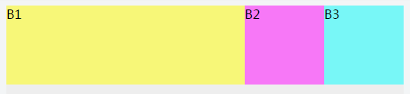
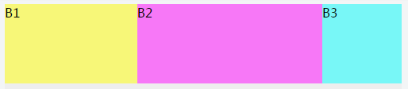
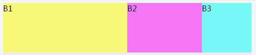
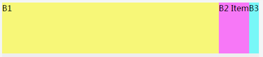
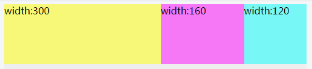
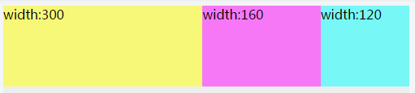

<!-- START doctoc generated TOC please keep comment here to allow auto update -->
<!-- DON'T EDIT THIS SECTION, INSTEAD RE-RUN doctoc TO UPDATE -->
**Table of Contents**  *generated with [DocToc](https://github.com/thlorenz/doctoc)*

- [flex 弹性盒子（新）](#flex-%E5%BC%B9%E6%80%A7%E7%9B%92%E5%AD%90%E6%96%B0)
  - [开启 Flex 弹性盒子](#%E5%BC%80%E5%90%AF-flex-%E5%BC%B9%E6%80%A7%E7%9B%92%E5%AD%90)
  - [flex-grow(default:0) 按比例分配父级剩余空间，默认为 0](#flex-growdefault0-%E6%8C%89%E6%AF%94%E4%BE%8B%E5%88%86%E9%85%8D%E7%88%B6%E7%BA%A7%E5%89%A9%E4%BD%99%E7%A9%BA%E9%97%B4%E9%BB%98%E8%AE%A4%E4%B8%BA-0)
  - [flex-basis (default:auto) 在分配剩余空间前，预约初始的默认空间（宽度）](#flex-basis-defaultauto-%E5%9C%A8%E5%88%86%E9%85%8D%E5%89%A9%E4%BD%99%E7%A9%BA%E9%97%B4%E5%89%8D%E9%A2%84%E7%BA%A6%E5%88%9D%E5%A7%8B%E7%9A%84%E9%BB%98%E8%AE%A4%E7%A9%BA%E9%97%B4%E5%AE%BD%E5%BA%A6)
  - [flex-shrink (default:1)](#flex-shrink-default1)
  - [flex-flow](#flex-flow)
  - [flex-wrap](#flex-wrap)
  - [flex-direction](#flex-direction)
  - [align-items](#align-items)
  - [justify-content](#justify-content)

<!-- END doctoc generated TOC please keep comment here to allow auto update -->

<!--
 * @Author: mrzou
 * @Date: 2021-07-23 14:34:08
 * @LastEditors: mrzou
 * @LastEditTime: 2021-07-23 15:42:01
 * @Description: file content
-->

## flex 弹性盒子（新）

旧的为 display: -webkit-box;

弹性盒子最大的特点就是剩余空间，那什么是剩余空间呢？具备 flex 环境的父容器，通常是有一条主轴和一条侧轴，
默认情况下主轴就是水平从左向右的，侧轴是垂直从上到下的（类似书写模式）。
剩余空间就是父容器在主轴的方向上还有多少可用的空间。比如看下面这段 html 结构：

```html
<div class="container">
  <div class="B1">B1</div>
  <div class="B2">B2</div>
  <div class="B3">B3</div>
</div>
```

container 就是父容器 B1 B2 B3 就是子容器
假如 container 的 width 是 500px
子元素都是 100px 的宽
那么剩余空间就是：500px - B1 的宽 - B2 的宽 - B3 的宽 = 200px

### 开启 Flex 弹性盒子

```css
.container {
  width: 500px;
  display: flex;
  div {
    width: 100px;
  }
}
```

### flex-grow(default:0) 按比例分配父级剩余空间，默认为 0

假如我们对 B1 设置 flex-grow:1
那么我们会发现 B1 把 B2 和 B3 都挤到右边了
也就是说剩余的 200px 空间都被 B1 占据了，所以此时 B1 的 width 比实际设置的值要大

```css
.B1 {
  flex-grow: 1;
}
```



所以这里 flex-grow 的意思已经很明显了，就是索取父容器的剩余空间
默认值是 0，就是三个容器都不索取剩余空间
但是当 B1 设置为 1 的时候，剩余空间就会被分成一份，然后都给了 B1
如果此时 B2 设置了 flex-grow:2，那么说明 B2 也参与到瓜分剩余空间中来，并且他是占据了剩余空间中的 2 份
那么此时父容器就会把剩余空间分为 3 份，然后 1 份给到 B1，2 份给到 B2，如下面这样子

```css
.B1 {
  flex-grow: 1;
}
.B2 {
  flex-grow: 2;
}
```



### flex-basis (default:auto) 在分配剩余空间前，预约初始的默认空间（宽度）

这个属性值的作用就是 width 的替代品。
如果子容器设置了 flex-basis 或者 width，那么在分配空间之前，他们会先跟父容器预约这么多的空间，
然后剩下的才是归入到剩余空间，然后父容器再把剩余空间分配给设置了 flex-grow 的容器。
如果同时设置 flex-basis 和 width，那么 width 属性会被覆盖，
也就是说 flex-basis 的优先级比 width 高。
有一点需要注意，如果 flex-basis 和 width 其中有一个是 auto
那么另外一个非 auto 的属性优先级会更高。

```css
.B1 {
  flex-grow: 2;
}
.B2 {
  flex-grow: 1;
}
.B3 {
  width: 100px;
  flex-basis: 100px; /* 优先级更高 */
  /***************************************************************/
  width: 100px; /* 优先级更高 */
  flex-basis: auto;
}
```



如果 flex-basis 和 width 都设为 auto 值
那剩余空间的分配就是根据内容多少来定的，内容多占据的空间就多。

```css
.B1 {
  flex-grow: 1;
}
.B2 {
  width: auto;
  flex-basis: auto;
}
.B3 {
  width: auto;
  flex-basis: auto;
}
```



### flex-shrink (default:1)

好了，上面讲了这么多，你们应该都明白了把。 有人会想，不就这样嘛，很容易啊，不就是剩余空间的分配吗？

是的，上面讲的都是剩余空间的分配。但是，你有没有想过还有没有其他的情况呢？可以发现，上面讲的例子 B1 B2 B3 的宽度总和都是没有超过父容器的宽度的。 那如果三个子容器的宽度和超过父容器的宽度呢？那还有剩余空间可以分配吗，此时浏览器又是怎么处理呢？请看下面：

**flex 环境默认是不换行的，即使父容器宽度不够也不会，除非设置 flex-wrap 来换行**

```css
.container {
  width: 500px;
  display: flex;
}
.B1 {
  width: 300px;
}
.B2 {
  width: 160px;
}
.B3 {
  width: 120px;
}
```



此时我们会发现，B1 设置的 flex-grow 没有作用，不但没有获取到剩余空间，他的空间甚至是比他定义的 300px 还要小，而且我们发现 B2 和 B3 的空间也相应的被压缩了。 那么这里的问题就是：1、为什么 flex-grow 没有作用，反而被压缩呢？2、三个容器的压缩比例是这样的呢？

这就是这一节的重点了 -> flex-shrink <-

同样的，三个容器处于 flex 环境中，所以布局之前，父容器还是会计算剩余空间。 这一次计算的结果是这样的：剩余空间＝ 500px - 300px - 160px - 120px = -80px，剩余空间是一个负数所以很容易理解第一个问题，即使是设置了 flex-grow，但是由于没有剩余空间，所以 B1 分配到的空间是 0。

由于 flex 环境的父容器的宽度 500px 是不会变，所以为了是子容器的宽度和最多为父容器的宽度，那就只有两个办法：第一个是使子容器换行，第二个是压缩子容器使之刚好撑满父容器的宽度。 因为 flex 子容器是默认不换行的，所以这里不做讨论。而第二种压缩，实际上就是上面例子表现出来的样式。现在就遇到了上面第二个问题，这三个的压缩比例是多少呢，各自需要压缩的空间是多少呢？

这个时候就需要谈谈 flex-shrink，这个属性其实就是定义一个子容器的压缩比例。他的默认值是 1，所以上面那个例子，就是三个子容器压缩的比例是一样的 1:1:1。 如果此时我们设置 B1 的压缩比例是 2，那会怎样呢？



我们可以发现，B1 被压缩的更多了。而 B2 和 B3 得到了跟多的空间。那我们怎么得出他们各自的压缩率呢？我们假设 B2 B3 的压缩率是 X1，那么 B1 的压缩率就是 X2 了，那就有了如下方程：

X2 = 2 _ X1;
500 = 300 _ X2 + 160 _ X1 + 120 _ X1;
通过上面我们就可以解出 X1 和 X2 等于多少了，这样就可以计算出压缩率和被压缩了多少空间了。

##总结 通过上面的分析，我们就可以得出这样几个结论：

1、剩余空间＝父容器空间－子容器 1.flex-basis/width - 子容器 2.flex-basis/width - …
2、如果父容器空间不够，就走压缩 flex-shrink，否则走扩张 flex-grow；
3、如果你不希望某个容器在任何时候都不被压缩，那设置 flex-shrink:0；
4、如果子容器的的 flex-basis 设置为 0(width 也可以，不过 flex-basis 更符合语义)，那么计算剩余空间的时候将不会为子容器预留空间。
5、如果子容器的的 flex-basis 设置为 auto(width 也可以，不过 flex-basis 更符合语义)，那么计算剩余空间的时候将会根据子容器内容的多少来预留空间。

### flex-flow

### flex-wrap

### flex-direction

### align-items

### justify-content
