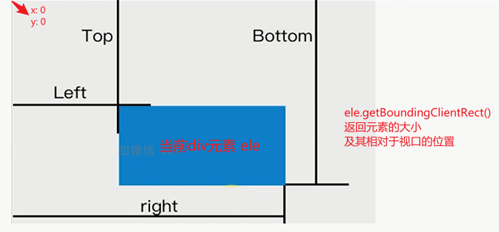

## getBoundingClientRect返回值解析



```
const rect = document.querySelector('div').getBoundingClientRect()

console.log(rect) 
// 得如下结果
{
  bottom: 294.45001220703125,
  height: 20,
  left: 298.9624938964844,
  right: 319.11249351501465,
  top: 274.45001220703125,
  width: 20.149999618530273,
  x: 298.9624938964844,
  y: 274.45001220703125
}
```
以上返回值 top right bottom left 都对应上图

从当前屏幕窗口左上角(0,0) 开始计算
