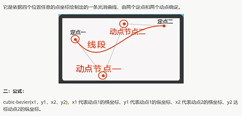

## css 贝塞尔曲线 cubic-bezier

 

```
<style>
.ball {
  transition: all 0.4s cubic-bezier(0.48, -0.35, 0.78, 0.45);
}
</style>
```
如上所示 cubic-bezier(0.48, -0.35, 0.78, 0.45) 中的四个值分别代表

节点一坐标：`x: 0.48  y: -0.35`

节点二坐标：`x: 0.78  y: 0.45`
