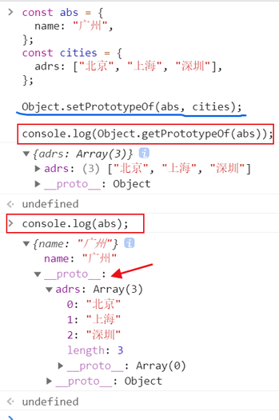
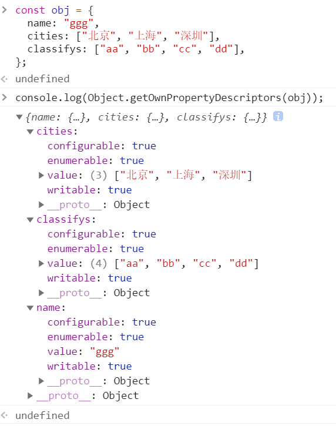

<!-- START doctoc generated TOC please keep comment here to allow auto update -->
<!-- DON'T EDIT THIS SECTION, INSTEAD RE-RUN doctoc TO UPDATE -->

**Table of Contents** _generated with [DocToc](https://github.com/thlorenz/doctoc)_

- [模块引用](#%E6%A8%A1%E5%9D%97%E5%BC%95%E7%94%A8)
- [解构](#%E8%A7%A3%E6%9E%84)

<!-- END doctoc generated TOC please keep comment here to allow auto update -->

<!--
 * @Author: mrzou
 * @Date: 2021-04-12 12:45:22
 * @LastEditors: mrzou
 * @LastEditTime: 2021-06-21 00:56:47
 * @Description: file content
-->

## 模块引用

```html
<script type="module">
  // module.js  分别暴露引用
    const React = {a:1, b:2}
    export class Component {
      state = {xxx: 22}
    }

    React.Component = Component

    export default React

    // 引用module文件 的 app.js
    const React, {Component} from 'react'


    // q1重名了 用 as 启用别名 q2 避免冲突
    import * as m1 from "./m1.js";
    import {q1, ta} from "./m1.js";
    import {q1 as q2, tu} from "./m2.js";

    // 简便形式  针对默认暴露
      // m3.js
      export default {
        school: 'ATGUIGU',
        change: function(){
            console.log("我们可以改变你!!");
        }
      }
      // 引用 m3.js
      import m3 from "./m3.js";
      import { default as m3 } from "./m3.js";
</script>
```

## 解构

- 解构 - 加默认赋值

  ```javascript
  const obj = { a: 55, b: 63 };
  // obj中可能没有 xx 这个属性，所以添加默认值 12
  const { a, b, xx = 12 } = obj;
  ```

- 解构 - 替代值

  ```javascript
  const obj = {
    a: 55,
    b: 63,
    c: { name: "mr", age: 18, addr: "广州天河", nick: "小A" },
    d: 63,
    e: 21,
  };
  const {
    a: val1,
    b: val2,
    xx: val3,
    c: { name, age, ...eOther },
    ...others
  } = obj;
  // 结果如下：
  // val1: 55                 // a这个key 怕与其他重名，所以用val1替代
  // val2: 63                 // b 和 a一样
  // val3: undefined          // 因为没有 xx这个属性，所以为 undefined
  // name: mr  age: 18  eOther: {addr: '广州天河', nick: '小A'}
  // others: {c: 63, d: 21}   // ...解构运算符，所其他所有值 赋值给了others 这个变量
  ```

- 使用 new Function

  ```javascript
  const print = new Function(
    "obj",
    "return `${Object.keys(obj).map(key => obj[key])}`"
  );
  print({ num: 63 }); // 66

  const aa = "name";
  const gg = "age";
  const print1 = new Function(
    "obj",
    "return `${" +
      "Object.keys(obj).map(key => {" +
      "return obj[" +
      JSON.stringify(aa) +
      "][" +
      JSON.stringify(gg) +
      "]" +
      "})" +
      "}`"
  );
  print1({ name: { age: 666 } }); // 666
  ```

## js 新增的第七种数据类型 Symbol

**js 的 7 种数据类型 usonb**
u: undefined
s: string symbol
o: object
n: null number
b: boolean

ES6 引入了一种新的原始数据类型 Symbol，表示独一无二的值。
它是 JavaScript 语言的第七种数据类型

1. Symbol 的值是唯一的，用来解决命名冲突的问题
2. Symbol 值不能与其他数据进行运算
3. Symbol 定义的对象属性不能使用 for…in 循环遍历,
   但是可以使用 **Reflect.ownKeys** 来获取对象的所有键名

```js
let s2 = Symbol("qq"); // 此时传入 的 qq 只是做注释一样的标识，无作用
let s3 = Symbol("qq");
console.log(s2 == s3); // false 值是唯一的，不相等

let s4 = Symbol.for("ww"); // 此时传入的 ww 会当做参数 两个参数相同的 symbol会相等
let s5 = Symbol.for("ww");
console.log(s2 === s3); // true 使用for方法创建的 且参数相同 会相等

// Symbol 创建对象属性 **************************************
const obj = {
  [Symbol("aa")]: 566,
};
// 使用 Reflect.ownKeys 来获取键名
console.log(obj[Reflect.ownKeys(obj)[0]]); // 566

const keys = {
  fun: Symbol("fun"),
};
const obj2 = {
  [keys.fun]: function () {
    return 666;
  },
};
console.log(obj2[keys.fun]()); // 666
```

### Symbol 内置属性

- Symbol.hasInstance
  当其他对象使用 instanceof 运算符，判断是否为该对象的实例时，会调用这个方法
- Symbol.isConcatSpreadable
  对象的 Symbol.isConcatSpreadable 属性等于的是一个布尔值，
  表示该对象用于 Array.prototype.concat()时，是否可以展开。

  ```js
  class Person {
    static [Symbol.hasInstance](param) {
      console.log(param); // 打印出了 o 这个对象  param就是o 当参数传了进来
      console.log("我被用来检测类型了");
      return false;
    }
  }

  let o = {};

  // 执行 instanceof 时会执行 static [Symbol.hasInstance] 中的方法
  // 并反回结果 false
  console.log(o instanceof Person); // false

  const arr = [1, 2, 3];
  const arr2 = [4, 5, 6];
  // 设为false了后 则arr2在被concat时不会被展开
  arr2[Symbol.isConcatSpreadable] = false;
  console.log(arr.concat(arr2)); // [1, 2, 3, [4, 5, 6]]
  ```

## 迭代器

遍历器（Iterator）就是一种机制。它是一种接口，为各种不同的数据结构提供统一的访问机制。
任何数据结构只要部署 Iterator 接口，就可以完成遍历操作

1. ES6 创造了一种新的遍历命令 for...of 循环，Iterator 接口主要供 for...of 消费
2. 原生具备 iterator 接口的数据(可用 for of 遍历)
   a) Array
   b) Arguments
   c) Set
   d) Map
   e) String
   f) TypedArray
   g) NodeList
3. 工作原理
   a) 创建一个指针对象，指向当前数据结构的起始位置
   b) 第一次调用对象的 next 方法，指针自动指向数据结构的第一个成员
   c) 接下来不断调用 next 方法，指针一直往后移动，直到指向最后一个成员
   d) 每调用 next 方法返回一个包含 value 和 done 属性的对象
   注: 需要自定义遍历数据的时候，要想到迭代器。

   ```js
   //声明一个数组
   const xiyou = ["唐僧", "孙悟空", "猪八戒", "沙僧"];

   //使用 for...of 遍历数组
   // for(let v of xiyou){
   //     console.log(v); // 分4次打印出了上面的结果
   // }

   let iterator = xiyou[Symbol.iterator]();

   //调用对象的next方法
   console.log(iterator.next()); // {value: "唐僧", done: false}
   console.log(iterator.next()); // {value: "孙悟空", done: false}
   console.log(iterator.next()); // {value: "猪八戒", done: false}
   console.log(iterator.next()); // {value: "沙僧", done: false}
   console.log(iterator.next()); // {value: undefined, done: true}
   ```

   自定义遍历数据

   ```js
   //声明一个对象
   const banji = {
     name: "终极一班",
     stus: ["xiaoming", "xiaoning", "xiaotian", "knight"],
     [Symbol.iterator]() {
       //索引变量
       let index = 0;
       const _this = this;
       return {
         next: function () {
           if (index < _this.stus.length) {
             const result = { value: _this.stus[index], done: false };
             //下标自增
             index++;
             //返回结果
             return result;
           } else {
             return { value: undefined, done: true };
           }
         },
       };
     },
   };

   //遍历这个对象
   for (let v of banji) {
     console.log(v);
   }
   ```

## 生成器

生成器函数是 ES6 提供的一种异步编程解决方案，语法行为与传统函数完全不同

```js
//生成器其实就是一个特殊的函数
//异步编程  纯回调函数  node fs  ajax mongodb
//函数代码的分隔符
function* gen() {
  console.log(111); // 第1次调next 执行这个 并反回 {value: "aaa", done: false}
  yield "aaa";
  console.log(222); // 第2次调next 执行这个 并反回 {value: "aaa", done: false}
  yield "bbb";
  console.log(333); // 第3次调next 执行这个 并反回 {value: "aaa", done: false}
  yield "ccc";
  console.log(444); // 第4次调next 执行这个 并反回 {value: undefined, done: true}
}

let iterator = gen();
console.log(iterator.next()); // {value: "aaa", done: false}
console.log(iterator.next()); // {value: "aaa", done: false}
console.log(iterator.next()); // {value: "aaa", done: false}
console.log(iterator.next()); // {value: undefined, done: true}

//遍历
// for(let v of gen()){
//     console.log(v); // 分 4 打印出上面的结果, 并执行 console.log
// }
```

**生成器函数参数传递**

```js
function* gen(arg) {
  console.log(arg, "001");   // AAA 001
let one = yield 111;         // {value: 111, done: false}
  console.log(one, "002");   // BBB 002
  let two = yield 222;       // {value: 222, done: false}
  console.log(two, "003");   // CCC 003
  let three = yield 333;     // {value: 333, done: false}
  console.log(three, "004"); // DDD 004
                             // 已经执行完，没有yield语法了 {value: undefined, done: true}
}

//执行获取迭代器对象
let iterator = gen("AAA");
console.log(iterator.next()); // {value: 111, done: false}
// next方法可以传入实参 并作为上一个 yield 的返回值
console.log(iterator.next("BBB")); // {value: 222, done: false}
console.log(iterator.next("CCC")); // {value: 333, done: false}
console.log(iterator.next("DDD")); // {value: undefined, done: true}

// 执行上面代码  得到结果如下:
AAA 001
{value: 111, done: false}
BBB 002
{value: 222, done: false}
CCC 003
{value: 333, done: false}
DDD 004
{value: undefined, done: true}
```

**生成器函数实例**

- demo1

  ```js
  // 异步编程  文件操作 网络操作(ajax, request) 数据库操作
  // 1s 后控制台输出 111  2s后输出 222  3s后输出 333
  // 回调地狱
  // setTimeout(() => {
  //     console.log(111);
  //     setTimeout(() => {
  //         console.log(222);
  //         setTimeout(() => {
  //             console.log(333);
  //         }, 3000);
  //     }, 2000);
  // }, 1000);

  function one() {
    setTimeout(() => {
      console.log(111);
      iterator.next(); // 向下调用
    }, 1000);
  }

  function two() {
    setTimeout(() => {
      console.log(222);
      iterator.next(); // 向下调用
    }, 2000);
  }

  function three() {
    setTimeout(() => {
      console.log(333);
      iterator.next(); // 向下调用 此时 反回 {done: true} 则结束生成器调用
    }, 3000);
  }

  function* gen() {
    yield one();
    yield two();
    yield three();
  }

  //调用生成器函数
  let iterator = gen();
  iterator.next();
  ```

- demo2

  ```js
  //模拟获取  用户数据  订单数据  商品数据
  function getUsers(preData) {
    setTimeout(() => {
      let data = "通过preData，获取到的用户数据";
      //调用 next 方法, 并且将数据传入
      iterator.next(data);
    }, 1000);
  }

  function getOrders(preData) {
    setTimeout(() => {
      let data = "通过preData，获取到的订单数据";
      iterator.next(data);
    }, 1000);
  }

  function getGoods(preData) {
    setTimeout(() => {
      let data = "通过preData，获取到的商品数据";
      iterator.next(data); // 执行完，则结束生成器调用
    }, 1000);
  }

  function* gen(arg) {
    let users = yield getUsers(arg);
    let orders = yield getOrders(users);
    let goods = yield getGoods(orders);
    console.log(goods); // 通过preData，获取到的商品数据
  }

  //调用生成器函数
  let iterator = gen({ userId: 888 });
  iterator.next();
  ```

## Set

ES6 提供了新的数据结构 Set（集合）。它类似于数组，但成员的值都是唯一的，
集合实现了 iterator 接口，所以可以使用『扩展运算符』和『for…of…』进
行遍历，集合的属性和方法：

1. size 返回集合的元素个数
2. add 增加一个新元素，返回当前集合
3. delete 删除元素，返回是否成功的 boolean 值
4. has 检测集合中是否包含某个元素，返回 boolean 值
5. clear 清空集合，返回 undefined

```js
//声明一个 set
let s1 = new Set(["小明", "小李", "小杰"]);
let s2 = new Set(["小明", "小李", "小杰", "小枫", "小萍"]);

// 由于成员的值都是唯一的  所以可用来  去重
[...new Set(["aa", "bb", "aa", "bb"])]; // ['aa', 'bb']

// 返回集合的元素个数
console.log(s2.size); // 5
//添加新的元素
s2.add("小倩"); // 新增加一个 并返回当前集合
//删除元素
s2.delete("小杰"); // true
//检测是否存在某个值
console.log(s2.has("小李"));
//清空集合
console.log(s2.clear()); // undefined

console.log(s2); // 空集合

// 集合实现了iterator接口 所以可以用 for of遍历
for (let v of s1) {
  console.log(v); // 依次打印 "小明"  "小李"  "小杰"
}
```

## Map

ES6 提供了 Map 数据结构。它类似于对象，也是键值对的集合。
但是“键”的范围不限于字符串，各种类型的值（包括对象）都可以当作键。
Map 也实现了 iterator 接口，所以可以使用『扩展运算符』和『for…of…』进行遍历。
Map 的属性和方法：

1. size 返回 Map 的元素个数
2. set 增加一个新元素，返回当前 Map
3. get 返回键名对象的键值
4. has 检测 Map 中是否包含某个元素，返回 boolean 值
5. clear 清空集合，返回 undefined

```js
//声明 Map
new Map([
  [1, 2],
  ["aa", { a: 56 }],
]);

let m = new Map();

//添加元素
m.set(666, "mrzou"); // key 可以为 数字
m.set("address", "广州"); // key 也可以为 字符串

m.set("change", function () {
  console.log("我们可以改变你!!");
});
let key = {
  age: 18,
};
// key 也可以为 对象
m.set(key, ["北京", "上海", "深圳"]); // set 返回当前最新的Map

const sym = Symbol("a");
m.set(sym, "Symbol"); // key 也可以为 Symbol

//size
console.log(m.size); // 3

//删除
m.delete(666); // true

//获取
console.log(m.get("change")); // function(){console.log("我们可以改变你!!");}
console.log(m.get(key)); // ["北京", "上海", "深圳"]
console.log(m.get(sym)); // Symbol

//遍历
for (let v of m) {
  // 依次以 数组形式 返回
  // ['address', '广州']
  // ['change', function(){}]
  // [{age:18}, ["北京", "上海", "深圳"]]
  console.log(v);
}

//清空
m.clear();
```

## class 类

ES6 提供了更接近传统语言的写法，引入了 Class（类）这个概念，作为对
象的模板。通过 class 关键字，可以定义类。基本上，ES6 的 class 可以看作只是
一个语法糖，它的绝大部分功能，ES5 都可以做到，新的 class 写法只是让对象
原型的写法更加清晰、更像面向对象编程的语法而已。

知识点：

1. class 声明类
2. constructor 定义构造函数初始化
3. extends 继承父类
4. super 调用父级构造方法
5. static 定义静态方法和属性
6. 父类方法可以重写

- 静态成员

```js
// es5写法
function Phone() {}

Phone.name = "手机";
Phone.change = function () {
  console.log("我可以改变世界");
};
Phone.prototype.size = "5.5inch";

let nokia = new Phone();

console.log(nokia.name);
nokia.change();
console.log(nokia.size);

// es6写法
class Phone2 {
  //静态属性
  static name = "手机";
  static change() {
    console.log("我可以改变世界");
  }
}

let nokia = new Phone2();
console.log(nokia.name);
console.log(Phone.name);
```

- es5 写法对象继承

```js
function Phone(brand, price) {
  this.brand = brand;
  this.price = price;
}

Phone.prototype.call = function () {
  console.log("我可以打电话");
};

//智能手机
function SmartPhone(brand, price, color, size) {
  Phone.call(this, brand, price);
  this.color = color;
  this.size = size;
}

//设置子级构造函数的原型
SmartPhone.prototype = new Phone();
SmartPhone.prototype.constructor = SmartPhone;

//声明子类的方法
SmartPhone.prototype.photo = function () {
  console.log("我可以拍照");
};

const chuizi = new SmartPhone("锤子", 2499, "黑色", "5.5inch");

console.log(chuizi);
```

- es6 写法对象继承

```js
class Phone {
  //构造方法
  constructor(brand, price) {
    this.brand = brand;
    this.price = price;
  }
  //父类的成员属性
  call() {
    console.log("我可以打电话!!");
  }
  gps() {
    console.log("我可以gps定位");
  }
}

class SmartPhone extends Phone {
  //构造方法
  constructor(brand, price, color, size) {
    super(brand, price); // Phone.call(this, brand, price)
    this.color = color;
    this.size = size;
  }

  // 原型方法
  photo() {
    console.log("我可以拍照");
  }
  // 重写 替换父类的call方法
  call() {
    console.log("我可以进行视频通话");
  }
}

const xiaomi = new SmartPhone("小米", 799, "黑色", "4.7inch");
// console.log(xiaomi);
xiaomi.call(); // 我可以进行视频通话
xiaomi.gps(); // 我可以gps定位

xiaomi.photo(); // 我可以拍照
```

## 数值扩展

ES6 提供了二进制和八进制数值的新的写法，分别用前缀 0b 和 0o 表示。
Number.isFinite() 用来检查一个数值是否为有限的
Number.isNaN() 用来检查一个值是否为 NaN
ES6 将全局方法 parseInt 和 parseFloat，移植到 Number 对象上面，使用不变。

Math.trunc 用于去除一个数的小数部分，返回整数部分
Number.isInteger() 用来判断一个数值是否为整数

```js
//0. Number.EPSILON 是 JavaScript 表示的最小精度
//EPSILON 属性的值接近于 2.2204460492503130808472633361816E-16
function equal(a, b) {
  if (Math.abs(a - b) < Number.EPSILON) {
    return true;
  } else {
    return false;
  }
}
console.log(0.1 + 0.2 === 0.3); // false
console.log(equal(0.1 + 0.2, 0.3)); // true

//1. 二进制和八进制
let b = 0b1010; // 2进制
let o = 0o777; // 8进制 //
let d = 100; // 10进制
let x = 0xff; // 16进制
console.log(x);

//2. Number.isFinite  检测一个数值是否为有限数
console.log(Number.isFinite(100)); // true
console.log(Number.isFinite(100 / 0)); // false
console.log(Number.isFinite(Infinity)); // false

//3. Number.isNaN 检测一个数值是否为 NaN
console.log(Number.isNaN(123)); // false

//4. Number.parseInt Number.parseFloat字符串转整数
console.log(Number.parseInt("868love")); //868
console.log(Number.parseFloat("3.14神奇")); //3.14

//5. Number.isInteger 判断一个数是否为整数
console.log(Number.isInteger(5)); // true
console.log(Number.isInteger(2.5)); // false

//6. Math.trunc 将数字的小数部分抹掉
console.log(Math.trunc(3.5)); // 3

//7. Math.sign 判断一个数到底为正数 负数 还是零
console.log(Math.sign(100)); // 1
console.log(Math.sign(0)); // 0
console.log(Math.sign(-20000)); // -1
```

## 对象扩展

ES6 新增了一些 Object 对象的方法

1. Object.is 比较两个值是否严格相等，与『===』行为基本一致（+0 与 NaN）
2. Object.assign 对象的合并，将源对象的所有可枚举属性，复制到目标对象
3. **proto**、setPrototypeOf、 setPrototypeOf 可以直接设置对象的原型

```js
//1. Object.is 判断两个值是否完全相等
console.log(Object.is(120, 120)); // === true
console.log(Object.is(NaN, NaN)); // === true
console.log(NaN === NaN); // ===  false

//2. Object.assign 对象的合并
const config1 = {
  host: "aaa",
  port: 101,
  test: "tt1",
};
const config2 = {
  host: "xxx",
  port: 102,
  test2: "tt2",
};
console.log(Object.assign(config1, config2)); //返回 { host: "xxx", port: 102, test: "tt1", test2: "tt2" }
// config1: { host: "xxx", port: 102, test: "tt1", test2: "tt2" }

//3. Object.setPrototypeOf 设置原型对象  Object.getPrototypeof
const abs = {
  name: "广州",
};
const cities = {
  adrs: ["北京", "上海", "深圳"],
};

Object.setPrototypeOf(abs, cities);

console.log(Object.getPrototypeOf(abs));
console.log(abs);
```



## ECMASript 7 新特性

Array.prototype.includes
Includes 方法用来检测数组中是否包含某个元素，返回布尔类型值

指数操作符
在 ES7 中引入指数运算符「\*\*」，用来实现幂运算，功能与 Math.pow 结果相同

```js
// includes   indexOf
const mingzhu = ["西游记", "红楼梦", "三国演义", "水浒传"];

//判断
console.log(mingzhu.includes("西游记")); // true
console.log(mingzhu.includes("金瓶梅")); // false

// **
console.log(2 ** 3); // 8  2的3次方 此运算和使用 Math.pow 是等效的
console.log(Math.pow(2, 3)); // 8
```

## ECMASript 8 新特性

async 和 await 两种语法结合可以让异步代码像同步代码一样

1. async 函数的返回值为 promise 对象，
2. promise 对象的结果由 async 函数执行的返回值决定
3. await 必须写在 async 函数中
4. await 右侧的表达式一般为 promise 对象
5. await 返回的是 promise 成功的值
6. await 的 promise 失败了, 就会抛出异常, 需要通过 try...catch 捕获处理

Object.values 和 Object.entries

1. Object.values()方法返回一个给定对象的所有可枚举属性值的数组
2. Object.entries()方法返回一个给定对象自身可遍历属性 [key,value] 的数组

Object.getOwnPropertyDescriptor 该方法返回指定对象所有自身属性的描述对象

```js
//声明对象
const obj = {
  name: "ggg",
  cities: ["北京", "上海", "深圳"],
  classifys: ["aa", "bb", "cc", "dd"],
};

//获取对象所有的键
console.log(Object.keys(obj));
// ['name', 'cities', 'classifys']

//获取对象所有的值
console.log(Object.values(obj));
// ["ggg", ["北京", "上海", "深圳"], ["aa", "bb", "cc", "dd"]]

//entries
console.log(Object.entries(obj));
// [["name","ggg"], ["cities",["北京","上海","深圳"]], ["classifys",["aa","bb","cc","dd"]]]

//创建 Map
const m = new Map(Object.entries(obj));
// [[Entries]]
// 0: {"name" => "ggg"}
// 1: {"cities" => Array(3)}    // ["北京", "上海", "深圳"]
// 2: {"classifys" => Array(4)} // ["aa", "bb", "cc", "dd"]
// size: (...)                  // 3
// __proto__: Map

console.log(m.get("cities")); // ["北京", "上海", "深圳"]

//对象属性的描述对象
console.log(Object.getOwnPropertyDescriptors(obj));

const obj = Object.create(null, {
  name: {
    // 这里设置的就是  对象属性的描述对象
    value: "qqq", //设置值
    //属性特性
    writable: true, // 是否可写
    configurable: true, // 是否可删除
    enumerable: true, // 是否可枚举
  },
});
```


