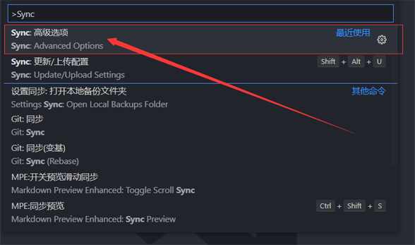
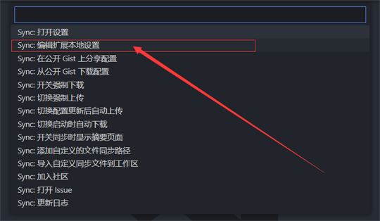
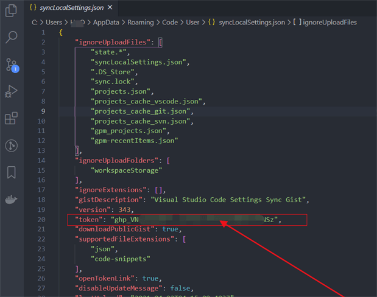
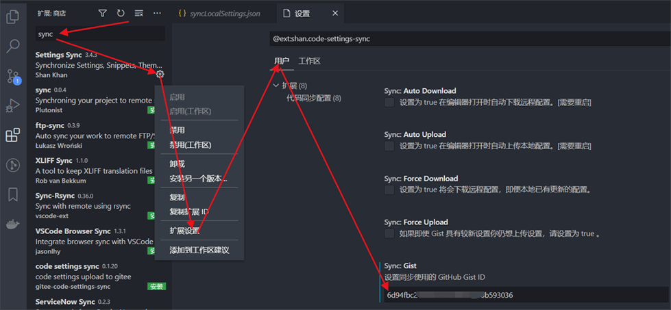
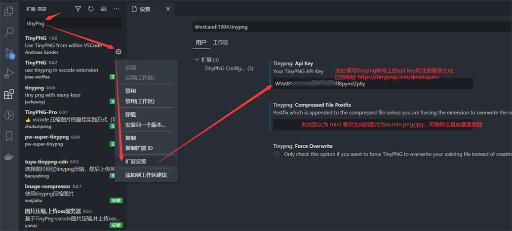
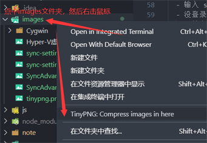
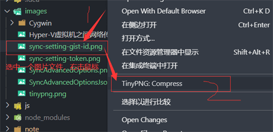

<!--
 * @Author: your name
 * @Date: 2021-04-02 10:59:23
 * @LastEditTime: 2021-04-02 15:22:53
 * @LastEditors: mrzou
 * @Description: In User Settings Edit
 * @FilePath: \blog\note\vscode-config.md
-->
## 使用 Settings Sync 插件，把 vscode 插件等配置保存在 GitHub 上
- 参考资料 https://blog.csdn.net/mrsyf/article/details/106184967
- vscode 中搜索 Settings Sync 并下载安装
- gitHub 设置里找到开发者设置

  ```mermaid
  graph TB
    my[我的]
    sets[Settings]
    devSet[Developer settings]
    perAc[Personal access tokens]
    genNewToken[Generate new token]
    noteName[Note:取个名字]
    rdioGist[勾选 gist]
    genToken[Generate token]

    my --> sets --> devSet --> perAc --> genNewToken --> noteName --> rdioGist --> genToken

  ```

- 1 记下 刚生成的 GitHub token
- 2 ctrl（Mac 是 command） + shift + p
- 3 输入 Sync: Advanced Options

  
- 4 Sync:编辑扩展本地配置

  
- 5 找到配置文件中 token 字段，并填写成记下的 token

  
- 6 ctrl + shift + p 选择 Sync: Upload / Update Settings (上传本地的配置)
- 7 记下生成的 gist id
- 8 忘记了 gist id 可以在 GitHub gist 这里查看

  ```mermaid
  graph TB
  my[我的]
  yourGists[Your gists]
  allGists[See all of your gists]
  openFile[打开settings.json文件]
  gtoken[找到sync.gist字段]
  my --> yourGists --> allGists --> openFile --> gtoken

  ```

- 其他电脑要下载本配置时
  - 安装 Settings Sync 插件，并重启
  - 重复第 4 到 5 步, 配置 token
  - 配置gist id

    
  - 重复第 2 步
  - 输入 sync，点击 Sync: Download Settings（下载配置到 vscode）
  - 没登录关联 github，会打开提示页面，点登录
    - 输入 sync，点击 Sync: Download Settings（下载配置到 vscode）
    - 开始下载配置，完成
  - 已登录过 - 开始下载配置，完成

## 插件推荐

- 参考资料https://www.imooc.com/article/39349
- 自动添加header信息插件koroFileHeader
  - 创建新文件时，会在顶部自动生成一些信息，如Author Date LastEditTime
- 非常好用的图片压缩插件tinyPng
  - 官网地址注册地址https://tinypng.com/developers
  - 需配置api key才使用
  
    
  - 使用方法
    - 压缩一个文件夹的图片

      
    - 压缩单个的图片

      
