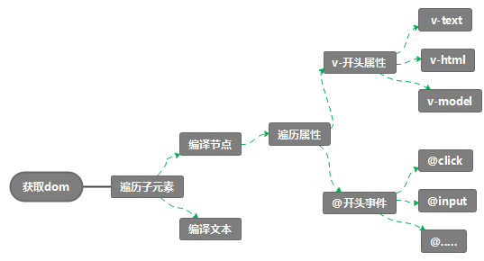

<!-- START doctoc generated TOC please keep comment here to allow auto update -->
<!-- DON'T EDIT THIS SECTION, INSTEAD RE-RUN doctoc TO UPDATE -->
**Table of Contents**  *generated with [DocToc](https://github.com/thlorenz/doctoc)*

- [简易版 Vue 实现](#%E7%AE%80%E6%98%93%E7%89%88-vue-%E5%AE%9E%E7%8E%B0)

<!-- END doctoc generated TOC please keep comment here to allow auto update -->

## 简易版 Vue 实现

- 编译器原理

  

- 核心类 Observer Compile Watcher Dep

  ```javascript
  // Vue.js
  // 数组响应式
  // 替换数组原型中7个方法
  const orginalProto = Array.prototype;
  // 备份一份，并修改备份
  const arrayProto = Object.create(orginalProto);
  ["push", "pop", "shift", "unshift"].forEach((method) => {
    arrayProto[method] = function () {
      // 原始操作
      orginalProto[method].apply(this, arguments);
      // 覆盖操作，通知更新
      console.log("数组执行：" + method + "操作");
    };
  });

  function defineReactive(obj, key, val) {
    // 递归
    observe(val);

    // Dep在这创建
    const dep = new Dep();

    Object.defineProperty(obj, key, {
      get() {
        console.log("get", key);
        // 依赖收集
        Dep.target && dep.addDep(Dep.target);
        return val;
      },
      set(v) {
        if (val !== v) {
          console.log("set", key);
          // 传入新值v可能还是对象
          observe(v);
          val = v;

          dep.notify();
        }
      },
    });
  }

  // 递归遍历obj，动态拦截obj的所有key
  function observe(obj) {
    if (typeof obj !== "object" || obj == null) {
      return obj;
    }

    // 每出现一个对象，创建一个Ob实例
    new Observer(obj);
  }

  // Observer: 判断传入obj类型，做对应的响应式处理
  class Observer {
    constructor(obj) {
      this.value = obj;

      // 判断对象类型
      if (Array.isArray(obj)) {
        // todo
        // 覆盖原型， 替换7个变更操作
        obj.__proto__ = arrayProto;
        // 对数组内部元素执行响应化
        // const keys = Object.keys(obj);
        for (let i = 0; i < obj.length; i++) {
          this.walk(obj[i]);
        }
      } else {
        this.walk(obj);
      }
    }

    // 对象响应式
    walk(obj) {
      Object.keys(obj).forEach((key) => {
        defineReactive(obj, key, obj[key]);
      });
    }
  }

  function proxy(vm) {
    Object.keys(vm.$data).forEach((key) => {
      Object.defineProperty(vm, key, {
        get() {
          return vm.$data[key];
        },
        set(v) {
          vm.$data[key] = v;
        },
      });
    });
  }

  class Vue {
    constructor(options) {
      // 保存选项
      this.$options = options;
      this.$data = options.data;

      // 2.响应式处理
      observe(this.$data);

      // 3.代理data到Vue实例上
      proxy(this);

      // 4.编译
      new Compile(options.el, this);
    }
  }

  class Compile {
    // el-宿主，vm-vue实例
    constructor(el, vm) {
      this.$vm = vm;
      this.$el = document.querySelector(el);

      this.compile(this.$el);
    }

    compile(el) {
      // 遍历el dom树
      el.childNodes.forEach((node) => {
        if (this.isElement(node)) {
          // element
          // 需要处理属性和子节点
          // console.log("编译元素", node.nodeName);
          this.compileElement(node);

          // 递归子节点
          if (node.childNodes && node.childNodes.length > 0) {
            this.compile(node);
          }
        } else if (this.isInter(node)) {
          // console.log("编译插值表达式", node.textContent);
          // 获取表达式的值并赋值给node
          this.compileText(node);
        }
      });
    }

    isElement(node) {
      return node.nodeType === 1;
    }

    // {{xxx}}
    isInter(node) {
      return node.nodeType === 3 && /\{\{(.*)\}\}/.test(node.textContent);
    }

    isDir(attr) {
      return attr.startsWith("v-");
    }

    isEvent(dir) {
      return dir.indexOf("@") == 0;
    }
    eventHandler(node, exp, dir) {
      // methods: {onClick: function(){}}
      const fn = this.$vm.$options.methods && this.$vm.$options.methods[exp];
      node.addEventListener(dir, fn.bind(this.$vm));
    }
    // 更新函数，
    update(node, exp, dir) {
      // init
      const fn = this[dir + "Updater"];
      fn && fn(node, this.$vm[exp]);

      // update: 创建Watcher
      new Watcher(this.$vm, exp, function (val) {
        fn && fn(node, val);
      });
    }

    // 编译文本，将{{ooxx}}
    compileText(node) {
      this.update(node, RegExp.$1, "text");
    }

    textUpdater(node, val) {
      node.textContent = val;
    }

    // 处理元素所有动态属性
    compileElement(node) {
      Array.from(node.attributes).forEach((attr) => {
        const attrName = attr.name;
        const exp = attr.value;

        // 判断是否是一个指令
        if (this.isDir(attrName)) {
          // 执行指令处理函数
          // v-text, 关心text
          const dir = attrName.substring(2);
          this[dir] && this[dir](node, exp);
        }

        // 事件处理
        if (this.isEvent(attrName)) {
          // @click="onClick"
          const dir = attrName.substring(1); // click
          // 事件监听
          this.eventHandler(node, exp, dir);
        }
      });
    }

    // v-text处理函数
    text(node, exp) {
      this.update(node, exp, "text");
    }

    // v-html
    html(node, exp) {
      this.update(node, exp, "html");
    }

    // v-model
    model(node, exp) {
      this.update(node, exp, "model");
      node.addEventListener("input", (e) => {
        this.$vm[exp] = e.target.value;
      });
    }

    modelUpdater(node, val) {
      node.value = val;
    }

    htmlUpdater(node, val) {
      node.innerHTML = val;
    }
  }

  // 小秘书：做dom更新
  class Watcher {
    constructor(vm, key, updateFn) {
      this.vm = vm;
      this.key = key;
      this.updateFn = updateFn;

      // 读取一下key的值，触发其get，从而收集依赖
      Dep.target = this;
      this.vm[this.key];
      Dep.target = null;
    }

    update() {
      this.updateFn.call(this.vm, this.vm[this.key]);
    }
  }

  // 依赖：和响应式对象的每个key一一对应
  class Dep {
    constructor() {
      this.deps = [];
    }

    addDep(dep) {
      this.deps.push(dep);
    }

    notify() {
      this.deps.forEach((dep) => dep.update());
    }
  }
  ```

- 使用 Vue

  ```html
  <meta http-equiv="Content-Type" content="text/html;charset=UTF-8" />
  <div id="app">
    <p>{{counter}}</p>
    <p v-text="counter"></p>
    <p v-html="desc"></p>
    <input type="text" style="width: 80%" v-model="desc" />
    <div style="margin-top: 20px">
      <button @click="onAdd">点击增加</button>
      <button @click="onReduce">点击减少</button>
    </div>
  </div>
  <script src="./vue.js"></script>
  <script>
    const app = new Vue({
      el: "#app",
      data: {
        counter: 1,
        desc: '<span style="color: red">测试的文本</span>',
      },
      methods: {
        onAdd() {
          this.counter++;
        },
        onReduce() {
          this.counter--;
        },
      },
    });

    setInterval(() => {
      app.counter++;
    }, 1000);
  </script>
  ```
