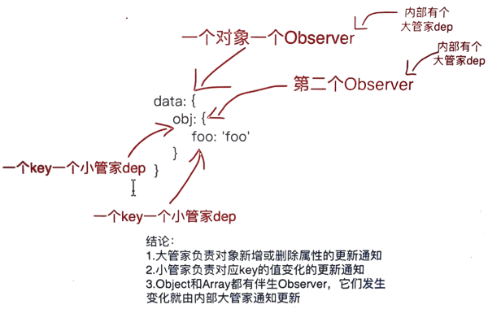

<!-- START doctoc generated TOC please keep comment here to allow auto update -->
<!-- DON'T EDIT THIS SECTION, INSTEAD RE-RUN doctoc TO UPDATE -->
**Table of Contents**  *generated with [DocToc](https://github.com/thlorenz/doctoc)*

- [搭建调试环境](#%E6%90%AD%E5%BB%BA%E8%B0%83%E8%AF%95%E7%8E%AF%E5%A2%83)
- [调试技巧](#%E8%B0%83%E8%AF%95%E6%8A%80%E5%B7%A7)
- [阅读的源码版本 umd 版本](#%E9%98%85%E8%AF%BB%E7%9A%84%E6%BA%90%E7%A0%81%E7%89%88%E6%9C%AC-umd-%E7%89%88%E6%9C%AC)

<!-- END doctoc generated TOC please keep comment here to allow auto update -->

## 搭建调试环境
- 获取地址：https://github.com/vuejs/vue
- 安装依赖：npm i
    - 报错：phantomjs-prebuilt@2.1.16 install: `node install.js`
        - 解决办法
            ```bash
            npm install phantomjs-prebuilt@2.1.16 --ignore-scripts
            ```
    - phantomjs（端到端测试）也可不装，安装到这里时，可以直接(ctrl+c)终止        
- 安装rollup: npm i -g rollup
- 修改dev脚本：添加 --sourcemap
    - 为了后面方便代码与文件之间的连系，开启vue打包时的sourcemap
    - 在package.json第17行rollup -w -c scripts/config.js后面添加 --sourcemap
- 执行dev的脚本: npm run dev    

## 调试技巧
- 浏览器打开指定文件 ctrl + p    
- 断点
- 单步执行 F10 进入函数 F11
- 查看调用栈 Call Stack
- 定位源文件所在位置
    - 在当前断点执行所在的代码文件中 - 鼠标右键 - 点击 Reveal in sidebar
    - 点击可在左侧文件目录中定位到源码文件所在目录及位置

## 阅读的源码版本 umd 版本
- npm run dev
- 入口文件 src\platforms\web\entry-runtime-with-compiler.js
    - 解析模版相关选项
- src\platforms\web\runtime/index.js
    - 安装平台patch 实现跨平台操作
    - 实现$mount('#app') => mountComponent: render() => vdom => patch() => 真实dom
- src\core\index  
    - 初始化全局API
- src\core\instance\index.js
    - Vue构造函数     
    - 声明实例属性和方法
- src\core\instance\init.js    
    - 初始化
- src\instance\lifecycle.js
    - mountComponent() => updateComponent => new Watcher() => updateComponent() = > render() => update() => patch() => 真实dom

     

