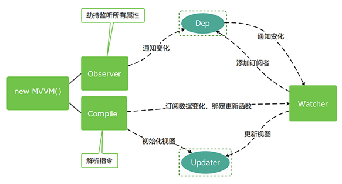

<!-- START doctoc generated TOC please keep comment here to allow auto update -->
<!-- DON'T EDIT THIS SECTION, INSTEAD RE-RUN doctoc TO UPDATE -->
**Table of Contents**  *generated with [DocToc](https://github.com/thlorenz/doctoc)*

- [vue](#vue)

<!-- END doctoc generated TOC please keep comment here to allow auto update -->

## vue
- vue的思路图
  

  - [vuex实现](vuex.md)
  - [vue-router实现](vue-router.md)
  - [observe实现](分析defineReactive函数并实现数据劫持函数observe.md)
  - [简易Vue实现-实现了编译器-依赖收集-数据响应式-视图更新](Vue-Observer+Compile+Watcher-Dep.md)
  - [Vue v2.6.12 源代码解析-代码逐行中文注释](https://github.com/zoujian3820/vue-source-code-analysis)
  - [vue-cli](vue-cli.md)

