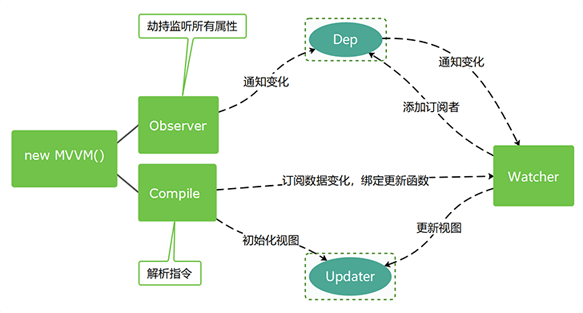

<!-- START doctoc generated TOC please keep comment here to allow auto update -->
<!-- DON'T EDIT THIS SECTION, INSTEAD RE-RUN doctoc TO UPDATE -->
**Table of Contents**  *generated with [DocToc](https://github.com/thlorenz/doctoc)*

- [vue](#vue)

<!-- END doctoc generated TOC please keep comment here to allow auto update -->

## vue
- vue的思路图
  

- 分析defineReactive函数 并实现数据劫持函数observe
```javascript
// Object.defineProperty()
// 将传入的obj，动态设置一个key，它的值val
function defineReactive(obj, key, val) {
  // 递归
  observe(val)
  
  Object.defineProperty(obj, key, {
    get() {
      console.log('get', key);
      return val
    },
    set(v) {
      if (val !== v) {
        console.log('set', key);
        // 传入新值v可能还是对象, 所以再做一次检测并劫持
        observe(v)
        
        // 由于是闭包，所以val字段已经成为内部私有变量
        // 所以此处赋值后，get里面能拿到更新的值
        // 相当于在函数顶部 val = val
        val = v
      }
    },
  })
}

// 递归遍历obj，动态拦截obj的所有key
function observe(obj) {
  if (typeof obj !== 'object' || obj == null) {
    return obj
  }
  Object.keys(obj).forEach(key => {
    defineReactive(obj, key, obj[key])
  })
}

// this.$set() 的实现
// Vue.set() 的实现
function set(obj, key, val) {
  // 由于用户可能添加，未在原对象中声明的新属性
  // 所以要做到劫持，必需使用此方式添加新属性
  defineReactive(obj, key, val)
}

const obj = {
  foo: 'foo',
  bar: 'bar',
  baz: {
    a: 1
  }
}
// defineReactive(obj, 'foo', 'foo')
observe(obj)

// obj.foo
// obj.foo = 'fooooooo'
// obj.baz.a
// obj.baz = { a: 10 }
// obj.baz.a
// obj.dong = 'dong'
// obj.dong
// set(obj, 'dong', 'dong')
// obj.dong
```
