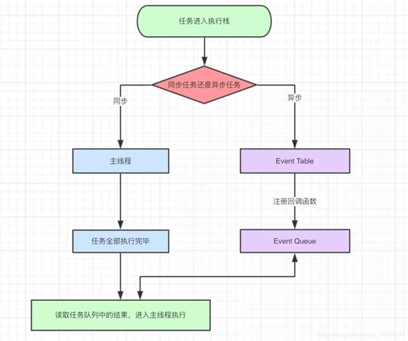
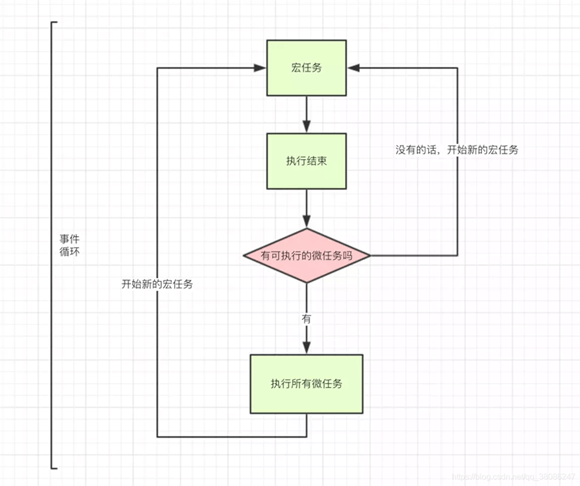

<!--
 * @Author: mrzou
 * @Date: 2020-09-01 09:40:11
 * @LastEditors: mrzou
 * @LastEditTime: 2021-05-19 15:54:13
 * @Description: file content
-->
<!-- START doctoc generated TOC please keep comment here to allow auto update -->
<!-- DON'T EDIT THIS SECTION, INSTEAD RE-RUN doctoc TO UPDATE -->
**Table of Contents**  *generated with [DocToc](https://github.com/thlorenz/doctoc)*

- [js中偏门一些的知识点记录下](#js%E4%B8%AD%E5%81%8F%E9%97%A8%E4%B8%80%E4%BA%9B%E7%9A%84%E7%9F%A5%E8%AF%86%E7%82%B9%E8%AE%B0%E5%BD%95%E4%B8%8B)
  - [e.target与e.currentTarget的区别](#etarget%E4%B8%8Eecurrenttarget%E7%9A%84%E5%8C%BA%E5%88%AB)
  - [宏任务（macrotask）与微任务（microtask）](#%E5%AE%8F%E4%BB%BB%E5%8A%A1macrotask%E4%B8%8E%E5%BE%AE%E4%BB%BB%E5%8A%A1microtask)
  - [代码触发原生事件](#%E4%BB%A3%E7%A0%81%E8%A7%A6%E5%8F%91%E5%8E%9F%E7%94%9F%E4%BA%8B%E4%BB%B6)

<!-- END doctoc generated TOC please keep comment here to allow auto update -->

# js中偏门一些的知识点记录下

## e.target与e.currentTarget的区别
  1. target是指当前点击到的实际元素对象
  2. currentTarget是指当前事件处理函数绑定的对象，

    <br/>而在log里看到的是null，是因为这个event是一个引用，在log的时候里面的一些属性被重置了
    <br/>这是因为currentTarget 只能用于事件正在处理过程中，当回调结束，会被重新赋值
    <br/>在log中打印要直接获值才不会被重置, 使用上也是

  ```javascript
  // 模似： 事件正在处理过程中， 故函数中能获取到值
  function clickFun(e) {
    console.log(e) // 因为引用类型原故，currentTarget为null
    console.log(e.currentTarget) // 打印出元素

    // 模似： 事件函数执行结束，currentTarget赋值为null
    e.currentTarget=null
  }

  clickFun({
    currentTarget: 55555,
    target: 6666
  })
  // 结果：
  // { currentTarget: null target: 6666 }
  // 55555
  ```

  3. 当要判断当前点击元素是否与绑定事件元素一致时，可用以下处理

  ```javascript
  function clickFun(e) {
    if(e.target === e.currentTarget){
      // to do...
    }
  }
  ```
## 宏任务（macrotask）与微任务（microtask）

  >...
  > 浏览器的事件循环机制会不停的检测自己当前有哪些任务要处理
  并把任务分为了宏任务与微任务 
  并且js是单线程工作，主线程一次只能有一个宏任务，多个宏任务会加入到宏任务队列
  **遇到定时器、IO 操作等，也会分别把回调函数加入到宏任务队列， 如：当计时器走完后会把回调函数勾到主线程宏任务中等待执行**
  > 
  > 微任务也会存在多个，多个微任务也会加入到微任务队列
  **在当前宏任务（除异步外的所有同步代码）执行结束前，会一次性清空微任务，
  也就是按照微任务加入的顺序，遍历执行一次**
  >
  > 然后发生页面UI上的重绘 接着等待浏览器的事件循环(**js会轮询访问宏任务对列，是否有可执行任务，有的话开始执行下一次的宏任务**) 开始检查宏任务对列，
  并开始下一次的宏任务（周而复始）
  >...

  - macrotask
    - setTimeout setInterval  （定时器）
    - MessageChannel  （消息通道）
    - window.postMessage （可以安全地实现跨源通信）
    - setImmediate  （IE专用）
    - requestAnimationFrame （告诉浏览器在下次执行重绘前，要做什么操作 而重绘在宏任务之前、微任务之后执行）
  - microtask
    - MutationObsever （提供了监视对DOM树所做更改的能力，Vue的nexTick实现就用到了，为兼容问题降级使用）
    - Promise.then  （Vue的nexTick实现第一优先使用的方法）
    - nodejs  Process.nextTick

  - 同步异步
  
    
    
  - 宏任务、微任务
  
    

- 可折叠注释
  ```javascript
  //#region
  中间是你要写的代码
  //#endregion
  ```

- 高阶函数				
  >如果一个函数符合下面2个规范中的任何一个，那该函数就是高阶函数。
  
  - 1.若A函数，接收的参数是一个函数，那么A就可以称之为高阶函数。
 
  - 2.若A函数，调用的返回值依然是一个函数，那么A就可以称之为高阶函数。
  
  - 常见的高阶函数有：Promise、setTimeout、arr.map()等等

- 函数的柯里化
  > 通过函数调用继续返回函数的方式，实现多次接收参数最后统一处理的函数编码形式。 
  ```javascript
  function sum(a){
    return(b)=>{
      return (c)=>{
        return a+b+c
      }
    }
  }
  ```
  ```javascript
  class Login extends React.Component{
    //初始化状态
    state = {
      username:'', //用户名
      password:'' //密码
    }

    // 保存表单数据到状态中
    // 使用 高阶函数	与 函数的柯里化 写法
    saveFormData = (dataType)=>{
      return (event)=>{
        this.setState({[dataType]:event.target.value})
      }
    }

    //表单提交的回调
    handleSubmit = (event)=>{
      event.preventDefault() //阻止表单提交
      const {username,password} = this.state
      alert(`你输入的用户名是：${username},你输入的密码是：${password}`)
    }
    render(){
      return(
        <form onSubmit={this.handleSubmit}>
          用户名：<input onChange={this.saveFormData('username')} type="text" name="username"/>
          密码：<input onChange={this.saveFormData('password')} type="password" name="password"/>
          <button>登录</button>
        </form>
      )
    }
  }
  ```
## 代码触发原生事件
```javascript
// target html节点
// evtName 事件名 如 input
export function dispatchEvent(target, evtName) {
  const evt = document.createEvent('HTMLEvents')
  evt.initEvent(evtName, true, true)
  target.dispatchEvent(evt)
}
```


